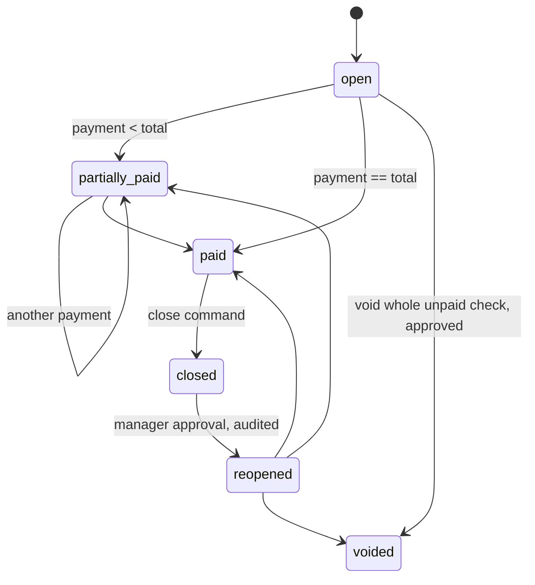
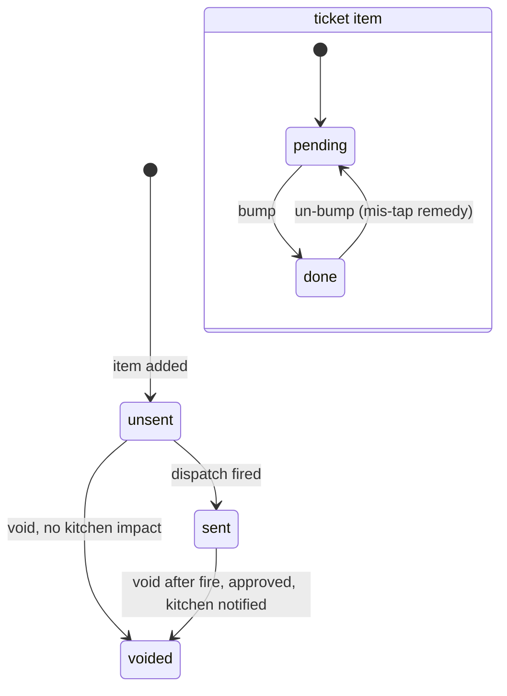

# RestaurantOS Domain Model

**Phase 2 artifact (WP-2.1), v1.0, 2026-08-12.** Companion to `schema.sql`. Sources: Toast report (ER model, state machines, sync protocol, command API), Square report (payment decomposition, correctness classes), founder domain input (KDS model, close-day model). Evidence labels per project convention.

This document says what the schema cannot say about itself: which transitions are legal, which invariants hold, who enforces what, and why the shape is the way it is.

## 1. The aggregate map

Commands never touch tables directly; they address an **aggregate**, the unit of consistency and optimistic concurrency. V1 has five:

| Aggregate | Root | Owns | Version column |
|---|---|---|---|
| Check | `checks` | order_item, order_item_modifier, check_adjustment, order_dispatch, dispatch_item | `checks.version` |
| Kitchen ticket | `kitchen_ticket` | kitchen_ticket_item | none (last-write-wins per item is acceptable: toggling a done flag is self-correcting) `INFERRED` |
| Payment intent | `payment_intent` | payment_attempt, payment, refund | provider reconciliation is the authority, not a version counter |
| Drawer session | `drawer_session` | cash_event | append-only ledger; no version needed |
| Business day | `business_day` | shift rollups, close result | close is a one-way transition guarded by blockers |

Menu configuration is not an aggregate: it is editor data that becomes an immutable `menu_snapshot` at publish. Service reads snapshots only.

## 2. The two state machines

Financial state and kitchen state are separate machines on separate tables, per the Toast report's core lesson. A check can be paid while food is still cooking; a table can be fully served and unpaid.

### Check lifecycle (`checks.status`)

Rules the domain layer enforces on top of the diagram:
- A check cannot take a payment while any line is `unsent` (bill nothing that never reached the kitchen).
- `paid` requires sum(payments in accepted states) >= total to the cent.
- `closed` is what releases the table (clears the party) and locks the check against everything except reopen.
- Reopen requires `check.reopen` permission and writes an audit_event with approver.

### Kitchen fulfillment (per item + derived per ticket)

Ticket-level status derives from items: all done = ready to serve; `served` releases the ticket and stays recallable for a grace window (`recalled` returns it to open). Serving is an expo action, not a station action. `OBSERVED` (founder, 3 years sous chef).

## 3. The command surface

The API is command-oriented: the client asks the domain to perform an operation, it never describes final database state. V1 commands (each maps to one sync_operation and one audit_event where privileged):

**Check**: `open_check`, `add_item`, `update_item_seat`, `set_covers`, `apply_adjustment`, `remove_adjustment`, `void_item`, `fire_course`, `hold_course`, `transfer_table`, `split_check`, `close_check`, `reopen_check`, `void_check`
**Kitchen**: `bump_item`, `unbump_item`, `serve_ticket`, `recall_ticket`
**Payment**: `create_intent`, `record_cash`, `start_card_attempt`, `record_offline_card`, `adjust_tip`, `request_refund`
**Cash/day**: `open_drawer_session`, `record_cash_event`, `close_drawer_session`, `open_business_day`, `close_business_day`
**Config**: `publish_menu_snapshot`, `set_availability` (the 86 board)

Every command envelope carries `operation_id` (client UUID), `device_id`, `employee_id`, `aggregate_id`, `expected_version`, and the payload. Replaying an `operation_id` returns the stored result from `sync_operation.result`; a stale `expected_version` returns `conflict` with the current version, and the client rebases or asks the employee. `DOCUMENTED` [Toast report].

## 4. The invariants ledger: who enforces what

| Invariant | Enforced by |
|---|---|
| Money is integer minor units | Schema (BIGINT) + domain money engine |
| A void carries reason + approver | Schema (`void_has_reason` CHECK) |
| An order item dispatches at most once | Schema (UNIQUE on dispatch_item.order_item_id) |
| One open session per physical drawer | Schema (partial unique index) |
| One business day per location per date | Schema (UNIQUE) |
| Adjustment is amount XOR percent | Schema (CHECK) |
| Split conservation: sum of splits == total, to the cent | Domain money engine + property tests (E1) |
| Modifier min/max/nesting validity | Domain validator (E3), same code client and server |
| Legal state transitions only | Domain state machines (E2), exhaustive transition tests |
| No payment while unsent lines exist | Domain check aggregate |
| "Pending upload" never displays as paid | Domain + UI contract (payment.status drives display) |
| Close blocked by open checks / unreconciled drawers / pending payments | Domain close_business_day command (E16) |
| Menu snapshot immutability | Convention + grants now; trigger guard in hardening (E18) |
| Card data never stored | Architecture: provider tokens only; no columns exist to violate it |

The split of responsibilities is deliberate: the database refuses *shapes* that are always wrong; the domain layer refuses *stories* that are wrong ("this check went from voided to paid"). Rules that need context live where context lives.

## 5. Design rationale worth remembering

- **`captured_name` / `unit_price_minor` on order lines, despite snapshots.** Lines reference their menu_snapshot AND denormalize what the guest saw. Belt and suspenders: history survives even a snapshot-format migration, and receipt reprints never join through menu config. `INFERRED`
- **Totals are computed, never stored.** A stored total is a cached lie waiting to happen; the money engine recomputes from lines + adjustments + tax class, and tests assert the recomputation is stable. Reporting materializes summaries later (P1 epic), sourced from the same engine.
- **Table status is derived.** The floor plan colors come from parties, checks, and tickets at read time. Storing status would create a second truth to keep synchronized.
- **The 1 AM problem.** `business_day_id` is stamped on the check at open time by a domain rule (service date rolls at a location-configured hour, e.g. 4 AM), so late-night checks land on the right day without report-time timestamp math.
- **Lunch + dinner need nothing special.** business_day 1:N shift, 1:N drawer_session. A between-services drawer swap is close session + open session, same day.
- **Provider neutrality.** `payment_attempt.provider` is text and `provider_ref` is opaque, so ADR-3 (Stripe vs Adyen) changes an adapter, not the schema.

## 6. What Matt's answers can still change (and what they cannot)

| Matt input | Schema impact |
|---|---|
| D6: LAN survival P0? | None. Affects deployment (edge process) and sync transport, not tables. |
| Auto-gratuity threshold | None. `check_adjustment.kind='auto_gratuity'` exists; the threshold is location config. |
| Tip adjust after auth | None on schema (`adjust_tip` command + attempt rows); constrains provider choice. |
| Bar tabs / preauth | Possible new `payment_attempt.status='preauthorized'` value: one CHECK-constraint migration. |
| Course/fire semantics | None. Courses are text keys, not enums. |
| Kitchen recall window, New window, expo rule | None. Policy config, not structure. |
| Merge checks (stub today) | New command + provenance rows if required. The check/party split already permits it. |

This table is the reason building the schema now is safe: the open questions are policy, and the schema stores policy *outcomes* (adjustments, events, statuses), not policy.

## 7. What this document is not

Not an API spec (Phase 2 continues: ADR-1..4 and the endpoint table), not a sync protocol spec (E10 design doc), not a reporting model (P1). Tax is a single `tax_class` key resolved by the money engine; real tax-rule modeling is scoped to the pilot jurisdiction in Phase 3.
