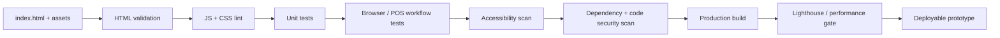
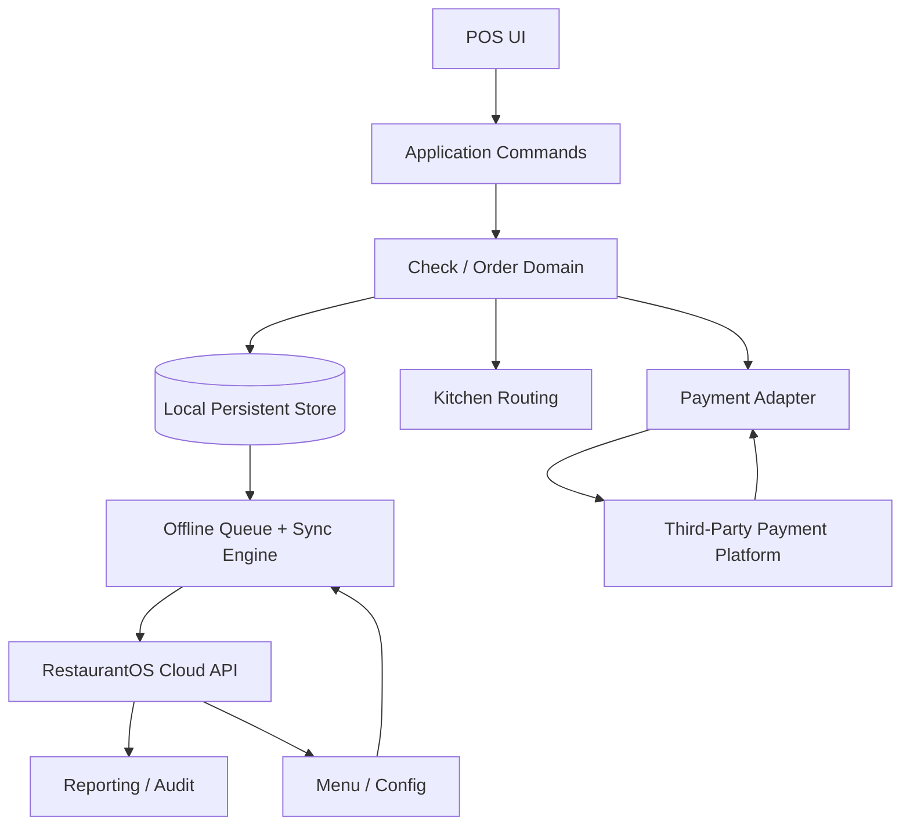
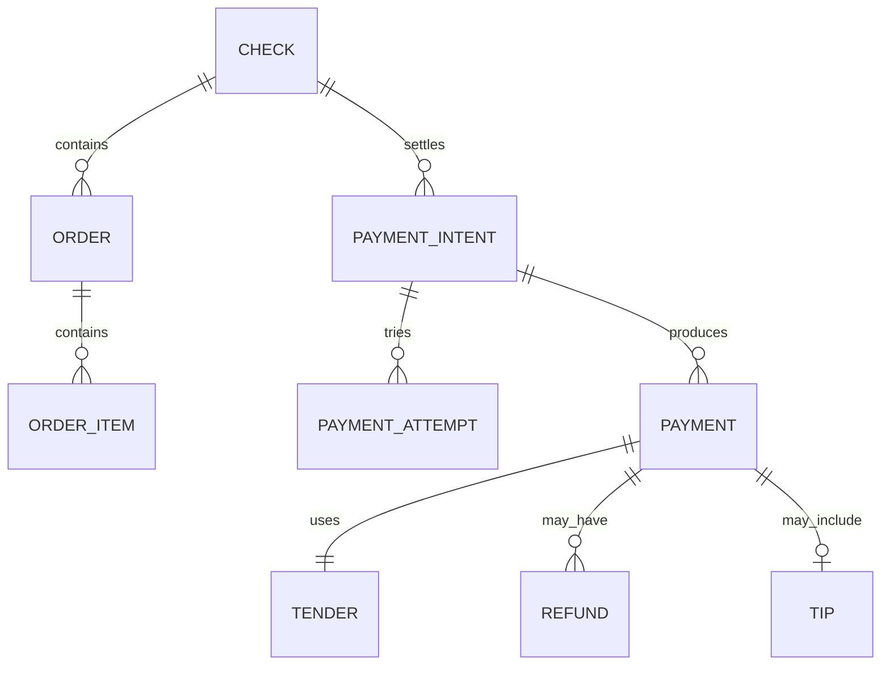

# RestaurantOS Project Audit and Actionable Engineering Report

## Executive summary

The biggest finding is simple: **the project cannot yet receive a trustworthy code-level audit because the actual `index.html` referenced by both your request and the RestaurantOS instructions is not available in the material I can inspect in this turn**. The accessible attachment contains the RestaurantOS/Square research specification and explicitly says the current `index.html` prototype must be opened and inspected as part of the RestaurantOS gap analysis. fileciteturn0file0

That means I cannot honestly extract the current DOM tree, enumerate its real CSS/JavaScript/image/font references, identify broken imports, detect unused selectors/functions, or produce line-specific fixes against the prototype. Those items are therefore marked **UNKNOWN / UNSPECIFIED**, rather than guessed.

The instructions themselves are much clearer than the codebase state. They define an ambitious **research and product-design specification**, not an implementation/build specification. They require analysis of Square's ecosystem, restaurant workflows, Orders/Catalog/Payments APIs, offline behavior, KDS, employee permissions, reporting, order/payment separation, multi-tenancy, architecture, PostgreSQL entities, state machines, MVP scope, roadmap, and testing. They also explicitly require the final research artifact `Square_Restaurants_Deep_Research_and_RestaurantOS_Build_Blueprint.md`. fileciteturn0file0 What they **do not** specify is a repository structure, package manager, Node version, framework version, concrete build tool, dependency manifest, linting policy, CI system, test runner, browser support matrix, or deployment target.

So the current situation is:

| Area | Assessment |
|---|---|
| RestaurantOS project/research specification | **DOCUMENTED / available** |
| `index.html` concept prototype | **UNKNOWN / unavailable for inspection** |
| HTML hierarchy | **UNKNOWN** |
| Linked CSS/JS/images/fonts | **UNKNOWN** |
| Inline CSS/JS | **UNKNOWN** |
| Broken imports/assets | **UNKNOWN** |
| JavaScript runtime errors | **UNKNOWN** |
| CSS validity/dead selectors | **UNKNOWN** |
| Current dependency versions | **UNKNOWN** |
| Required dependency versions | **UNSPECIFIED by instructions** |
| Existing build system | **UNKNOWN** |
| Existing test system | **UNKNOWN** |
| Existing CI/CD | **UNKNOWN** |
| Security controls | **UNKNOWN** |
| Square research artifact | **Required by project instructions; not part of the inspected material** |
| Toast research companion document | **Referenced by instructions; unavailable here** |

The first engineering fix is therefore not React, Electron, TypeScript, or a POS feature. It is **making the repository auditable and reproducible**: put `index.html` and every referenced local asset into the same reviewable source tree; add an explicit manifest and lockfile once Node tooling is introduced; document how the prototype starts; then establish automated HTML, JavaScript, CSS, security, accessibility, and browser smoke checks.

For the eventual production POS, there is another important conclusion already supported by the project specification: **do not let this `index.html` prototype harden into the production architecture by accident**. The instructions correctly recognize that a sellable POS requires offline order continuity, explicit order/check/payment state machines, local persistence, KDS routing, permissions, cash reconciliation, auditing, multi-device concurrency, payment-provider abstraction, and daily close—not merely an order-entry UI. fileciteturn0file0

A sensible near-term quality gate is:



The official tooling supports this shape well: ESLint exposes CI-friendly warning/error thresholds, Stylelint provides comparable CSS checks, Prettier supports deterministic format checking, Playwright provides browser-level end-to-end testing, Lighthouse audits performance/accessibility/best practices, npm supplies dependency vulnerability auditing, and GitHub can add Dependabot and CodeQL scanning. citeturn0search3turn0search0turn1search3turn2search3turn0search1turn2search0turn3search1


## Evidence baseline and project inventory

### What is actually available

**OBSERVED:** The provided RestaurantOS instructions describe the intended Square research project in great detail. They explicitly say to inspect both the project instructions and current `index.html`, classify findings as `DOCUMENTED`, `OBSERVED`, `INFERRED`, or `UNKNOWN`, and avoid claiming knowledge of proprietary Square internals. They also expressly say the final RestaurantOS implementation must have its own architecture, source code, design system, and UX rather than reproducing Square. fileciteturn0file0

**UNKNOWN:** `index.html` itself is not available to this audit. Consequently, its source code and every asset transitively referenced by it are also unavailable.

That distinction matters. A missing stylesheet referenced as `./styles.css` is an actionable bug. A stylesheet that simply has not been supplied to the reviewer is not evidence of a bug. The report therefore distinguishes **missing from the codebase** from **missing from the review evidence**.

### Current versus required state

| Artifact / configuration | Requirement source | Current evidence | Status | Version assessment | Consequence |
|---|---|---|---|---|---|
| RestaurantOS project instructions | User/project specification | Available as attached text | **Present** | N/A | Requirements can be analyzed |
| `index.html` | Explicitly referenced and required for Part 15 gap analysis | Not available for inspection | **Missing from review set** | N/A | Blocks actual frontend audit |
| CSS linked from `index.html` | Implicit dependency of prototype if used | Unknown | **UNSPECIFIED** | Unknown | Cannot detect dead/broken CSS |
| JavaScript linked from `index.html` | Implicit dependency of prototype if used | Unknown | **UNSPECIFIED** | Unknown | Cannot detect runtime/import issues |
| Images/icons | Derived from HTML/CSS | Unknown | **UNSPECIFIED** | N/A | Cannot audit broken paths or size |
| Fonts | Derived from HTML/CSS | Unknown | **UNSPECIFIED** | Unknown | Cannot audit loading/privacy/performance |
| `package.json` | Not required by supplied instructions | Unknown | **UNSPECIFIED** | Unknown | Build/dependency model unknown |
| package lockfile | Not required by supplied instructions | Unknown | **UNSPECIFIED** | Unknown | Reproducibility unknown |
| ESLint configuration | Not specified | Unknown | **UNSPECIFIED** | Unknown | JS quality gate absent or unverifiable |
| Stylelint configuration | Not specified | Unknown | **UNSPECIFIED** | Unknown | CSS quality gate absent or unverifiable |
| Prettier configuration | Not specified | Unknown | **UNSPECIFIED** | Unknown | Formatting policy unverifiable |
| Test runner/config | Test *plan* required, implementation tooling unspecified | Unknown | **UNSPECIFIED** | Unknown | Automated regression coverage unknown |
| GitHub Actions/other CI | Requested by this audit; not specified in project instructions | Unknown | **UNSPECIFIED** | Unknown | Build gates unknown |
| Square research Markdown | Explicit required deliverable | Not supplied as current project artifact | **Not present in review set** | N/A | Research milestone still separate |
| Toast research document | Identified as future companion input | Not supplied | **UNSPECIFIED** | N/A | Cannot cross-reference prior conclusions |

There are therefore **no defensible “mismatched dependency versions” to report**. The instructions provide no required package versions, and no dependency manifest has been supplied from which current versions could be extracted. Calling anything outdated at this stage would be fabrication.

### HTML structure and asset inventory

The requested current-state extraction is:

| Requested item | Result |
|---|---|
| `<!doctype>` | **UNKNOWN** |
| `<html>` language declaration | **UNKNOWN** |
| `<head>` metadata | **UNKNOWN** |
| Viewport configuration | **UNKNOWN** |
| CSP/referrer metadata | **UNKNOWN** |
| Main semantic structure | **UNKNOWN** |
| Navigation/header | **UNKNOWN** |
| POS order-entry region | **UNKNOWN** |
| Check/cart region | **UNKNOWN** |
| Table/floor-plan UI | **UNKNOWN** |
| Payment UI | **UNKNOWN** |
| Modal/dialog structure | **UNKNOWN** |
| Inline `<style>` blocks | **UNKNOWN** |
| Inline `<script>` blocks | **UNKNOWN** |
| Inline event handlers | **UNKNOWN** |
| External stylesheets | **UNKNOWN** |
| External JavaScript | **UNKNOWN** |
| Images/icons | **UNKNOWN** |
| Web fonts | **UNKNOWN** |
| CDN dependencies | **UNKNOWN** |

No useful DOM tree can be reconstructed without inventing details.

Once `index.html` is present, asset extraction should cover more than obvious `<script>` and `<link>` tags. It should resolve `src`, `srcset`, `<source>`, ``, favicon/manifest links, CSS `url(...)`, `@font-face`, dynamic imports, static `import` declarations, fetch URLs, worker scripts, service workers, and any remote CDN resource. The W3C HTML Checker can then be used programmatically or interactively to validate modern HTML markup. citeturn4search5


## Static code, security, and performance audit

### JavaScript review status

No JavaScript source was available, so these are **audit targets, not findings**:

| Check | Current status | What constitutes a real problem |
|---|---|---|
| Syntax errors | UNKNOWN | Parser failure |
| Undefined variables | UNKNOWN | References not declared/imported |
| Missing imports | UNKNOWN | Module cannot resolve dependency |
| Broken script paths | UNKNOWN | HTTP/file 404 |
| Wrong execution order | UNKNOWN | Dependency executes after consumer |
| Duplicate globals/functions | UNKNOWN | Last declaration unexpectedly shadows earlier code |
| Dead functions | UNKNOWN | Unreachable/unreferenced production code |
| Duplicate listeners | UNKNOWN | Handler registered repeatedly |
| Unsafe DOM injection | UNKNOWN | Untrusted input passed to HTML-parsing sinks |
| Inline event handlers | UNKNOWN | `onclick=`, `onchange=`, etc. complicating CSP |
| `eval` / dynamic Function | UNKNOWN | Dynamic code execution |
| Secrets in frontend | UNKNOWN | API/payment/private credentials shipped to browser |
| Excessive localStorage use | UNKNOWN | Sensitive or authoritative POS state stored without a stronger model |
| Race conditions | UNKNOWN | Simultaneous order edits overwrite one another |
| Missing idempotency | UNKNOWN | Retries duplicate state-changing actions |
| Parser-blocking scripts | UNKNOWN | Classic scripts run during HTML parsing |
| Large/dead JS bundles | UNKNOWN | Unnecessary download/parse/execution cost |

Two checks deserve particular emphasis for a POS.

First, any use of `innerHTML` or similar HTML-parsing sinks with user-controlled or remotely sourced content needs security review. MDN explicitly identifies `innerHTML` as an injection sink capable of creating XSS exposure, and OWASP's DOM-XSS guidance treats client-side injection as the application's responsibility. citeturn5search2turn5search5 Restaurant item names, guest names, free-form notes, employee names, integration data, and online-order metadata must not become “trusted” just because they originated from your own API.

Second, loading strategy should be deliberate. Plain classic `<script src>` elements without `async`, `defer`, or modules can interrupt document parsing; `defer` preserves execution order after parsing, while ES modules are deferred by default. citeturn5search1 For a POS shell, predictable ordering is generally more important than racing unrelated scripts with `async`.

### CSS review status

The CSS is equally unavailable, so the following remain **UNKNOWN**:

| CSS concern | Status | Review criterion |
|---|---|---|
| Invalid declarations/selectors | UNKNOWN | Stylelint/browser parse errors |
| Missing imported CSS | UNKNOWN | `@import` or `<link>` target unavailable |
| Dead selectors | UNKNOWN | Selectors have no matching production markup |
| Duplicate rule blocks | UNKNOWN | Same component declarations repeated |
| Excessive specificity | UNKNOWN | Difficult overrides / maintenance |
| Excessive `!important` | UNKNOWN | Cascade architecture breaking down |
| Global leakage | UNKNOWN | Generic selectors unexpectedly affect other views |
| Hard-coded tablet dimensions | UNKNOWN | Prototype only works at one display size |
| Missing focus styles | UNKNOWN | Keyboard/accessibility regression |
| Inadequate touch targets | UNKNOWN | Difficult operation on terminals/handhelds |
| Expensive effects | UNKNOWN | Large blur/shadow/filter/repaint cost |
| Font loading problems | UNKNOWN | Layout shift or blocking |
| CSS-generated functional information | UNKNOWN | Critical information unavailable to assistive tech |
| Print styles | UNKNOWN | Receipt/report behavior unknown |

Stylelint supports command-line linting, autofixing and CI-significant exit codes, making it appropriate once stylesheet files exist. citeturn0search0

### Security controls that must be verified

The prototype should eventually be checked for a real Content Security Policy rather than relying solely on correct application code. CSP can restrict script/resource origins and provide defense in depth against XSS; MDN recommends testing a policy in report-only mode before enforcement. Strict policies can also block object embedding and restrict base URIs. citeturn4search0turn4search6

A POS deserves a relatively strict posture because its UI handles employee identities, orders, customer information, operational data and payment orchestration. That does **not** mean card PAN/CVV should ever become frontend application data. The project instructions already point in the right direction by preferring third-party payment infrastructure rather than owning raw card-data responsibility in V1. fileciteturn0file0

External CDN scripts and styles, if the prototype uses any, should be minimized. Where a cross-origin static dependency must be loaded directly, Subresource Integrity allows the browser to verify that the fetched resource matches an expected cryptographic hash. citeturn1search0 Self-hosted, pinned build dependencies are generally easier to reason about than runtime CDN dependencies for an operational POS.

A referrer policy should also be explicit once URLs may contain identifiers or operational routing information. `Referrer-Policy` controls how much originating URL information gets sent on subsequent resource requests or navigation. citeturn5search0

### Performance review

No current asset sizes or timings are available, so there is no measured performance finding yet.

The correct workflow is **measure, establish a baseline, then optimize**. Lighthouse provides audits covering performance, accessibility and web best practices and can run from DevTools, a CLI or Node; Lighthouse CI can repeatedly run those checks and enforce regression thresholds. citeturn0search1turn6search1

For this particular product, conventional page-load metrics are only half the story. A POS also needs application-specific latency budgets such as:

| Operation | Recommended engineering target |
|---|---:|
| Tap item → visible on check | Perceptually immediate; avoid network dependency |
| Open modifier dialog | Immediate from local state |
| Switch menu category | Immediate |
| Send order → local acknowledgement | Immediate local commit before sync |
| KDS routing acknowledgement | Deterministic and observable |
| Restore after process crash | Seconds, with current check intact |
| Resume after Internet recovery | Automatic reconciliation |
| Re-render 100+ line check | No visible input lag |

Those numbers should become measured product SLOs during architecture work; they are design recommendations, not claims about the unavailable prototype.


## Cross-check against the RestaurantOS project instructions

### What the instructions actually require

The supplied document is an unusually comprehensive **research specification**. It asks RestaurantOS to study Square as a benchmark for simple restaurant UX, modular commerce architecture, payment infrastructure, API design, hardware abstraction, extensibility and restaurant functionality layered on a broader commerce platform. It specifically prohibits copying proprietary source, branding, implementation, trade dress or copyrighted UI. fileciteturn0file0

Its required analytical scope includes:

| Domain | Requirement captured from instructions |
|---|---|
| Square ecosystem | POS, Restaurants, hardware, KDS, Dashboard, Online, APIs and adjacent products |
| Restaurant workflow | Quick/full service, bars, tables, seats, coursing, checks, modifiers, payment/splits, gratuity, KDS, online ordering, staffing, reporting |
| UX | Order entry, navigation, tables, checks, modifiers, split/payment flows, handheld and KDS usage |
| Domain modeling | Orders API as public evidence, but create a restaurant-specific RestaurantOS model |
| Catalog | Items, variations, modifiers, categories, taxes, availability and restaurant specialization |
| Payments | Payments API, Terminal API, POS API, Mobile Payments SDK and processor-abstraction choices |
| Payment responsibility | Strong preference not to own raw card-data responsibility in V1 |
| Order/payment separation | Explicit `Check`, `Order`, `PaymentIntent`, `PaymentAttempt`, `Payment`, `Refund`, `Tender`, `Tip` thinking |
| Offline | Separate order-offline capability from payment-offline capability |
| API/event design | REST, webhooks, idempotency, versions, OAuth, locations and devices |
| Multi-tenancy | Organization/group/location/device/employee hierarchy and config inheritance |
| Kitchen | Tickets, stations, expeditor, routing, timers, 86ing and completion |
| Employee/security | Roles, permissions, clocking, refunds, comps, voids and manager authority |
| Reporting | Sales, payments, drawers, tax, tips, discounts, refunds and daily close |
| Prototype gap analysis | Explicit inspection of current `index.html` |
| Product simplicity | Smallest *sellable* full-service POS, not smallest demo |
| Architecture | POS client, local DB, offline queue, sync, cloud API and bounded business modules |
| Client technology | Evaluate web/PWA, Electron, React Native, Flutter, native Android and alternatives |
| Backend shape | Explicit modular-monolith versus microservices evaluation |
| Database | Conceptual PostgreSQL restaurant domain |
| Lifecycle rigor | Mermaid state diagrams for six key state machines |
| MVP | P0/P1/P2/not-POS categorization |
| Roadmap | Coding-agent-friendly incremental stages |
| Testing | Broad transaction, failure and concurrency scenarios |
| Deliverable | One comprehensive Markdown research/build-blueprint artifact |

All of those requirements are present in the supplied project instructions. fileciteturn0file0

### What the instructions do not specify

This is where a key distinction appears. The document asks that technologies be **evaluated**, but it intentionally does not commit RestaurantOS to React, PWA, Electron, React Native, Flutter or native Android. It similarly asks for an architectural recommendation rather than naming an existing backend framework. fileciteturn0file0

Accordingly, these implementation details are presently unspecified:

| Implementation concern | Required value |
|---|---|
| Node.js version | **Unspecified** |
| npm/pnpm/yarn/bun | **Unspecified** |
| React version | **Unspecified / React itself not selected** |
| TypeScript | **Unspecified** |
| Vite/Webpack/Rspack/etc. | **Unspecified** |
| Electron version | **Unspecified / Electron not selected** |
| Native runtime | **Unspecified** |
| Server framework | **Unspecified** |
| PostgreSQL version | **Unspecified** |
| ORM/query layer | **Unspecified** |
| Test framework | **Unspecified** |
| CI provider | **Unspecified** |
| Hosting provider | **Unspecified** |
| Observability stack | **Unspecified** |
| Source directory layout | **Unspecified** |
| Environment variable contract | **Unspecified** |
| Browser/OS support matrix | **Unspecified** |
| Device hardware SDKs | **Unspecified** |

That is not necessarily a defect. At the research stage, refusing to lock in framework choices before the domain, offline model and hardware requirements are understood is sensible.

### Actual mismatches

There are three concrete gaps between the supplied evidence and the specification.

**High-impact mismatch — prototype inspection is blocked.** The instructions explicitly require opening the current `index.html`, determining what it unrealistically simplifies, comparing its capabilities against Square, and identifying missing KDS/product functionality. fileciteturn0file0 Without the file, that requirement cannot be completed.

**Medium-impact mismatch — companion research material is absent.** The instructions say the final Square artifact should later be usable alongside the RestaurantOS instructions, existing `index.html`, and Toast research document. fileciteturn0file0 The Toast material is not available in this review set, so contradictory or duplicate architectural conclusions cannot yet be reconciled.

**Medium-impact process gap — build reproducibility is not specified.** The instructions define what should be researched but not how the prototype is reproduced or validated. Once JavaScript dependencies exist, a checked-in manifest/lockfile and deterministic install command should become part of the project contract. npm documents `npm ci` specifically for installing from the locked dependency state rather than modifying it during CI. citeturn2search6


## Prioritized remediation plan

The risk column below means **risk of leaving the problem unresolved**, not risk that the change itself will break the prototype.

| Priority | Change | Why | Effort | Unresolved risk | Acceptance criterion |
|---|---|---|---|---|---|
| **P0** | Put the real `index.html` in the review/repository source set | Everything else depends on it | Low | **Critical** | Auditor/build can open exact committed prototype |
| **P0** | Include every local asset referenced by HTML/CSS/JS | Prevent phantom missing-file analysis | Low | **High** | No unresolved local asset references |
| **P0** | Document a one-command startup path | Prototype must be reproducible | Low | **High** | Fresh checkout can run without tribal knowledge |
| **P0** | Verify no payment secrets/private credentials are in browser code | POS/payment boundary must stay clean | Low | **Critical** | Secret scan and manual review clean |
| **P0** | Audit DOM injection points | Restaurant notes/integration data make XSS materially relevant | Medium | **Critical** | No unsanitized untrusted HTML injection |
| **P0** | Preserve order state across client restart before moving toward pilot | A UI-only in-memory check model is not operationally safe | High | **Critical** | Active check survives forced process termination |
| **P0** | Separate domain order state from payment transaction state | Required by RestaurantOS research/design spec | High | **Critical** | Partial/split/cash/card payments model cleanly |
| **P1** | Add HTML validation | Catch malformed markup early | Low | Medium | Validator clean or explicit exceptions |
| **P1** | Add ESLint | Detect JS defects and enforce hygiene | Low | High | CI exits nonzero on lint violation |
| **P1** | Add Stylelint | Detect invalid/fragile CSS | Low | Medium | CI exits nonzero on CSS violation |
| **P1** | Add Prettier | Eliminate formatting churn | Low | Low | `format:check` passes |
| **P1** | Add browser-level Playwright tests | POS behavior is interaction-heavy | Medium | **High** | Core workflows run headlessly in CI |
| **P1** | Add accessibility scanning | Touch UI still needs semantic/keyboard/accessibility correctness | Medium | Medium | Automated scan has no unaccepted serious violations |
| **P1** | Introduce a restrictive CSP | Defense in depth against script injection | Medium | **High** | Report-only clean, then enforcing policy |
| **P1** | Self-host or integrity-pin runtime CDN assets | Reduce supply-chain exposure | Medium | High | No unprotected arbitrary third-party executable assets |
| **P1** | Add dependency auditing and update monitoring | Dependency vulnerabilities evolve independently of app code | Low | High | Audit + Dependabot/security equivalent enabled |
| **P1** | Establish CI | Quality gates must be automatic | Low-Medium | High | Every PR runs deterministic validation |
| **P1** | Define browser/device support targets | POS hardware cannot be “whatever browser works” | Medium | High | Written support matrix with automated coverage |
| **P1** | Create an authoritative domain model before expanding prototype UI | Prevent DOM components becoming business-state model | High | **Critical** | State machines/entities exist independently of UI |
| **P2** | Add Lighthouse CI budgets | Catch web-performance regressions | Low-Medium | Medium | Thresholds evaluated on each relevant build |
| **P2** | Add CodeQL/static security scanning | Broader automated vulnerability analysis | Low | Medium | Scheduled/PR scans active |
| **P2** | Add visual regression testing for primary terminal layouts | POS layout regressions can impair operations | Medium | Medium | Baselines for supported terminal sizes |
| **P2** | Add network/offline chaos scenarios | Central requirement for RestaurantOS | High | **Critical before pilot** | Defined failure matrix passes |
| **P2** | Introduce feature/module boundaries | Avoid monolithic UI file becoming accidental architecture | Medium | High | Order/menu/payment/KDS concerns separated |

The most important product fix is the domain boundary, not a styling cleanup:



That architecture is **INFERRED / RECOMMENDED**, not something proven to exist in the unavailable prototype. It follows the explicit local-database, offline-command-queue, sync-engine, cloud, kitchen, payment-adapter, employee, reporting and audit concerns listed in the RestaurantOS specification. fileciteturn0file0


## Testing, CI/CD, and recommended tooling

### Proposed local quality commands

This assumes the project adopts Node-based developer tooling. It does **not** assume Node must be the production POS runtime.

A sensible baseline is:

```bash
# Deterministic dependency installation after a lockfile exists
npm ci

# Formatting
npm run format:check

# Static validation
npm run lint
npm run lint:css
npm run validate:html

# Automated behavior
npm run test
npm run test:e2e

# Production artifact
npm run build

# Dependency security
npm audit --audit-level=high
```

ESLint supports command-line execution and `--max-warnings`, allowing CI to reject a build when warnings exceed an explicit threshold. citeturn0search3 Stylelint similarly supports CLI execution over CSS globs and exits with failures for lint problems. citeturn0search0 Prettier supports check/write workflows and project-level ignore/config files. citeturn1search3 npm's current audit command reports known dependency vulnerabilities, supports an `--audit-level` CI threshold, and distinguishes reporting from automatic remediation. citeturn2search0

I would **not** run `npm audit fix --force` automatically in CI. npm's own documentation notes that `--force` relaxes protections and can install changes outside declared dependency ranges, including SemVer-major updates. citeturn2search0 Security updates should create a reviewed change, then run the full regression suite.

### Tooling stack

| Purpose | Recommended tool | Rationale |
|---|---|---|
| HTML validity | W3C HTML Checker | Standards-oriented markup validation |
| JavaScript linting | ESLint | Mature static correctness/style framework |
| CSS linting | Stylelint | CSS-specific correctness and convention checks |
| Formatting | Prettier | Deterministic formatting |
| Browser E2E | Playwright Test | Chromium/WebKit/Firefox, isolation, assertions and CI support |
| Accessibility | Playwright + `@axe-core/playwright` | Integrates accessibility checks into real browser flows |
| Performance | Lighthouse / Lighthouse CI | Performance, accessibility and best-practice audits/regression gates |
| Dependency vulnerabilities | `npm audit` | Native audit of npm dependency tree |
| Dependency monitoring | Dependabot | Repository-level vulnerable-dependency alerts/updates |
| Static security | CodeQL | Finds vulnerabilities/errors in supported source languages |
| Source control CI | GitHub Actions if GitHub-hosted | Natural integration with lint/test/security gates |

Playwright includes its own test runner, assertions, browser isolation and support for Chromium, WebKit and Firefox, making it a good fit for interaction-heavy POS workflow tests. citeturn2search3 Its accessibility guidance integrates directly with `@axe-core/playwright`, while also warning that automation cannot detect every accessibility problem and should be supplemented with manual testing. citeturn6search3

GitHub's CodeQL code scanning is designed to detect vulnerabilities and coding errors, while Dependabot monitors dependency graphs for packages associated with security advisories. citeturn3search1turn3search0

### Proposed developer-tool bootstrap

After the actual source tree is known:

```bash
npm install --save-dev \
  eslint \
  @eslint/js \
  prettier \
  stylelint \
  stylelint-config-standard \
  @playwright/test \
  @axe-core/playwright
```

I would **not** blindly install framework-specific ESLint plugins, TypeScript, React, Vite or Electron packages until the architecture decision is made. The project instructions deliberately leave those choices open. fileciteturn0file0

A proposed scripts section is:

```json
{
  "scripts": {
    "format": "prettier . --write",
    "format:check": "prettier . --check",
    "lint": "eslint . --max-warnings=0",
    "lint:css": "stylelint \"**/*.css\" --max-warnings=0",
    "test:e2e": "playwright test",
    "security:deps": "npm audit --audit-level=high"
  }
}
```

`validate:html`, `test`, `dev`, `build`, and `preview` should only be filled in after the actual repository/build technology is established rather than pretending those commands already exist.

### Recommended test layers

A restaurant POS needs more than DOM snapshots.

**Static layer:** validate HTML, lint JS/CSS, perform type checking if TypeScript is selected, scan secrets and dependencies.

**Domain layer:** test money math, taxes, discounts, service charges, modifier validation, quantity rules, order/check lifecycle, payment allocation, refunds, audit creation and concurrency independently of the UI.

**Persistence layer:** prove an active check survives reload/process kill/device restart and that an offline command cannot silently disappear.

**Browser workflow layer:** Playwright should cover real operator actions such as opening a table, adding items, selecting required modifiers, changing seat/course, sending to kitchen, splitting a check, accepting cash/card allocations and completing a check. Playwright is built for user-action-plus-assertion browser tests and automatically waits for elements to become actionable. citeturn2search4

**Failure layer:** the supplied RestaurantOS specification already calls for Internet loss, synchronization recovery, duplicated requests, terminal crashes, KDS disconnects, printer failure and simultaneous updates from two terminals. fileciteturn0file0 These are production correctness tests, not edge-case polish.

**Accessibility layer:** scan primary screens with axe through Playwright and perform manual terminal testing. Automated tools catch only a subset of accessibility defects. citeturn6search3turn6search0

**Performance layer:** use Lighthouse for web-platform regressions, then separately measure POS-specific latency such as tap-to-render, transaction persistence, check restoration and sync recovery. Lighthouse can run locally or as part of automated workflows, and Lighthouse CI is intended to prevent regressions over time. citeturn0search1turn6search2

### Initial CI pipeline

GitHub's current Node.js Actions guidance supports installing locked dependencies with `npm ci` and then running the project's ordinary build/test commands in CI. citeturn3search4turn2search6

A starting workflow would look like this:

```yaml
name: restaurantos-ci

on:
  pull_request:
  push:
    branches: [main]

jobs:
  quality:
    runs-on: ubuntu-latest

    steps:
      - name: Checkout
        uses: actions/checkout@v6

      - name: Setup Node
        uses: actions/setup-node@v4
        with:
          node-version-file: ".nvmrc"
          cache: npm

      - name: Install locked dependencies
        run: npm ci

      - name: Check formatting
        run: npm run format:check

      - name: Lint JavaScript
        run: npm run lint

      - name: Lint CSS
        run: npm run lint:css

      - name: Validate HTML
        run: npm run validate:html

      - name: Unit tests
        run: npm test

      - name: Build
        run: npm run build

      - name: Browser tests
        run: npm run test:e2e

      - name: Dependency vulnerability gate
        run: npm audit --audit-level=high
```

The `.nvmrc` and scripts are **proposed project contracts**, not current files. Pinning a supported Node runtime rather than leaving CI on an implicit version prevents “works locally, fails in CI” drift.

Once a hosted test build exists, add Lighthouse CI separately rather than overloading the correctness job:

```bash
npx lhci autorun
```

Lighthouse CI is specifically designed for recurring audits and regression assertions, including performance budgets. citeturn6search1


## Critical configuration and code-change examples

Because `index.html` is unavailable, the following are **conditional remediation examples**, not patches against observed lines.

### Secure HTML shell

If the prototype currently contains a giant inline `<style>` and inline `<script>`, a better stepping-stone is to externalize executable/style resources:

```diff
 <head>
+  <meta charset="utf-8">
+  <meta
+    name="viewport"
+    content="width=device-width, initial-scale=1, viewport-fit=cover"
+  >
+  <meta name="referrer" content="strict-origin-when-cross-origin">

-  <style>
-    /* thousands of lines */
-  </style>
+  <link rel="stylesheet" href="./assets/css/app.css">
 </head>

 <body>
   <main id="app">
     <!-- POS application -->
   </main>

-  <script>
-    // application logic
-  </script>
+  <script type="module" src="./assets/js/app.js"></script>
 </body>
```

Modules are deferred by default, whereas classic unqualified scripts can block parsing. citeturn5search1 Externalizing inline executable code also makes a strict CSP considerably easier than permitting unrestricted inline scripts. MDN explicitly warns that allowing `'unsafe-inline'` weakens CSP's XSS protections. citeturn4search0

### Replace string-built DOM with DOM APIs

If the prototype contains code resembling:

```js
orderElement.innerHTML += `
  <div class="order-item">
    ${item.name}
    <span>${item.note}</span>
  </div>
`;
```

that should be treated as a high-priority review point whenever any interpolated value can originate outside hard-coded trusted source.

A safer pattern is:

```js
const row = document.createElement("div");
row.className = "order-item";

const name = document.createElement("span");
name.className = "order-item__name";
name.textContent = item.name;

const note = document.createElement("span");
note.className = "order-item__note";
note.textContent = item.note ?? "";

row.append(name, note);
orderElement.append(row);
```

`textContent` avoids asking the browser to parse data as HTML. That matters because `innerHTML` is an HTML injection sink and can become an XSS vector with attacker-controlled strings. citeturn5search2turn5search5

### External dependencies

If a CDN resource is truly necessary, do not leave it as an unpinned executable dependency:

```diff
- <script src="https://cdn.example/library.js"></script>

+ <script
+   src="https://cdn.example/library.min.js"
+   integrity="sha384-REPLACE_WITH_VERIFIED_HASH"
+   crossorigin="anonymous"
+   defer
+ ></script>
```

The hash must be generated from the **exact pinned resource**; the placeholder above must never ship. SRI causes the browser to verify that the fetched script or stylesheet matches the expected cryptographic digest before using it. citeturn1search0

For a production POS, my preference is stronger: bundle/self-host dependencies where practical so normal dependency management, lockfiles, audits and deployment integrity govern them rather than an uncontrolled runtime CDN.

### CSP starter policy

For a self-hosted prototype with no required third-party runtime origins, begin in report-only mode with something close to:

```http
Content-Security-Policy-Report-Only:
  default-src 'self';
  script-src 'self';
  style-src 'self';
  img-src 'self' data:;
  font-src 'self';
  connect-src 'self';
  object-src 'none';
  base-uri 'none';
  frame-ancestors 'none';
```

Then enumerate legitimate payment/API/WebSocket origins before enforcement.

MDN recommends report-only deployment as a way to discover breakage before enabling enforcement, and recommends controls such as `object-src 'none'` and restrictive base URI handling in a strict CSP. citeturn4search0turn4search6

Do not “fix” violations with:

```http
script-src 'self' 'unsafe-inline' 'unsafe-eval' *
```

That largely destroys the value of the control. citeturn4search0

### Frontend state should not be the ledger

A common prototype mistake is effectively:

```js
let currentOrder = [];
let total = 0;
```

with DOM state and JavaScript arrays serving as the authoritative check.

For a real RestaurantOS terminal, the direction should instead be:

```text
UI action
   ↓
validated domain command
   ↓
atomic local persistence
   ↓
domain event / updated aggregate
   ↓
UI projection
   ↓
offline synchronization queue
   ↓
cloud acknowledgement
```

The UI becomes a projection of persisted state rather than the ledger itself.

That architectural distinction is central to the supplied specification's emphasis on local databases, offline queues, sync engines, explicit check/order/payment state and terminal crash/restart recovery. fileciteturn0file0

### Payment state must not be represented by one boolean

Avoid concepts like:

```js
order.paid = true;
```

A restaurant transaction can be materially more complicated than that. The project requirements explicitly give the example of a `$120` check paid through `$40` Visa, `$50` cash and `$30` Mastercard, with subsequent tip behavior, and call for separate `PaymentIntent`, `PaymentAttempt`, `Payment`, `Refund`, `Tender` and `Tip` concepts. fileciteturn0file0

The conceptual relationship should be closer to:



This is **Recommended RestaurantOS architecture based on requirements learned from Square**, as requested by the attached specification—not a claim about Square's proprietary implementation. fileciteturn0file0


## Production-readiness implications for RestaurantOS

The most dangerous outcome would be treating the missing `index.html` as merely a file-transfer inconvenience and then resuming feature work unchanged. The project instructions themselves reveal that the prototype is only the visible tip of a much larger system. fileciteturn0file0

A production full-service POS has at least four different kinds of correctness:

**Interaction correctness:** the server can enter Pad Thai, select protein/spice/exclusions, assign seats, fire courses and split a check quickly.

**Financial correctness:** taxes, discounts, service charges, tips, partial tenders, refunds, cash and card allocations reconcile exactly.

**Distributed-state correctness:** two terminals editing the same table, a disconnected KDS, a crashed device and a recovering Internet connection cannot silently destroy or duplicate orders.

**Operational correctness:** managers can explain who voided what, why a drawer is short, which payments settled, which items were sold and whether the day's numbers reconcile.

The supplied project requirements explicitly cover each of those classes through modifier validation, payment splitting, offline recovery, duplicate requests, concurrent terminal updates, KDS failures, permissions, reporting and close-of-day requirements. fileciteturn0file0

That leads to an important design rule:

> **Do not refactor `index.html` into “cleaner frontend code” and call that RestaurantOS V1 architecture.**

The prototype should be treated as a **UX hypothesis**. Production architecture should be built around restaurant-domain invariants, local persistence, state machines, command idempotency, payment isolation, kitchen routing and auditability. The UI should sit on top of those capabilities.

A practical transition looks like this:

```mermaid
flowchart LR
    A[Single-file concept prototype] --> B[Auditable static prototype]
    B --> C[Componentized UX prototype]
    C --> D[Explicit domain model]
    D --> E[Local persistent POS runtime]
    E --> F[Offline sync architecture]
    F --> G[Kitchen + payment adapters]
    G --> H[Reporting + RBAC + audit]
    H --> I[Pilot-ready RestaurantOS]
```



The key gate is between **C** and **D**. That is where RestaurantOS stops being a polished demo and starts becoming a transaction system.

### Definition of done for the current prototype audit

The current code-audit task should be considered complete only when these facts are known rather than assumed:

| Evidence required | Completion test |
|---|---|
| Exact `index.html` | Source available and hashed/committed |
| Complete DOM outline | Major sections/elements mapped |
| Complete asset graph | Every local/remote CSS, JS, image and font enumerated |
| Asset resolution | No unintended missing resource |
| Inline script inventory | Every inline block/event handler located |
| Inline style inventory | Every inline style block/attribute located |
| JS dependency graph | Imports and script-order dependencies identified |
| JS static analysis | Errors, globals, dead code and dangerous DOM sinks reviewed |
| CSS static analysis | Invalid/dead/duplicated/high-specificity rules reviewed |
| CDN inventory | Versions, SRI and business necessity documented |
| Dependency manifest | Package versions known if dependencies exist |
| Security baseline | CSP, secret exposure and XSS surface assessed |
| Accessibility baseline | Automated + manual critical workflow assessment |
| Performance baseline | Resource sizes and runtime measures captured |
| Browser/device baseline | Supported viewport/runtime targets tested |
| Requirements map | Prototype capabilities mapped against RestaurantOS requirements |
| Production-gap list | Prototype-only assumptions explicitly documented |

Until that evidence exists, the correct finding for the current HTML/JS/CSS implementation is **UNKNOWN**, not “looks fine.”

### Bottom-line priorities

The engineering sequence I would use from here is:

**First:** make the real prototype and complete asset tree reviewable and reproducible.

**Second:** immediately run HTML validation, ESLint, Stylelint, browser-console/network checks, DOM-XSS review, dependency inventory, accessibility checks and a Lighthouse baseline. The W3C checker, ESLint, Stylelint, Playwright, axe and Lighthouse all have current supported tooling for those purposes. citeturn4search5turn0search3turn0search0turn2search3turn6search3turn0search1

**Third:** add deterministic CI. Use a lockfile and `npm ci` if npm-based tooling is selected; reject lint errors, failing tests and high-severity dependency findings automatically. citeturn2search6turn2search0 Enable repository dependency monitoring and code scanning where available. citeturn3search0turn3search1

**Fourth:** treat any current single-file JavaScript application state as disposable prototype architecture. Establish `Check`, `Order`, `OrderItem`, modifier, kitchen, payment, employee and audit domain boundaries before piling more UI features onto it, consistent with the supplied specification. fileciteturn0file0

**Fifth:** make local persistence and crash recovery a foundational requirement—not a later “offline feature.” The instructions correctly distinguish **order offline capability** from **payment offline capability**; that distinction should shape the implementation from the beginning. fileciteturn0file0

**Sixth:** keep payment processing behind an adapter boundary and outside the order model. The project specification's preference not to own raw card-data handling in V1 should remain a hard architectural constraint until a deliberate payments/security/compliance decision changes it. fileciteturn0file0

**Seventh:** do not call the system pilot-ready until its automated tests include the failure cases already specified by the project: required modifiers, taxes, discounts, comps, pre/post-kitchen voids, check/item splitting, cash/card partial payments, card decline, reopened checks, table/employee transfers, Internet failure/recovery, duplicate requests, terminal restart, KDS disconnect, printer failure and simultaneous terminal updates. fileciteturn0file0

The core assessment is therefore **high architectural promise, insufficient implementation evidence**. The RestaurantOS instructions demonstrate serious awareness of production POS complexity; the unavailable `index.html` prevents determining whether the prototype reflects that sophistication or remains primarily a front-end simulation. The next audit should not infer the answer—it should prove it from the actual source and asset graph.