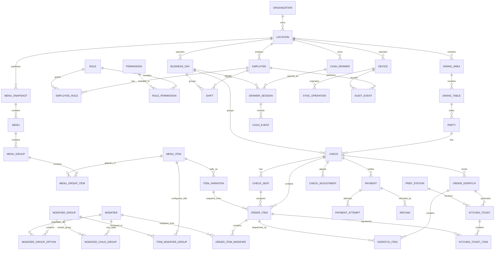
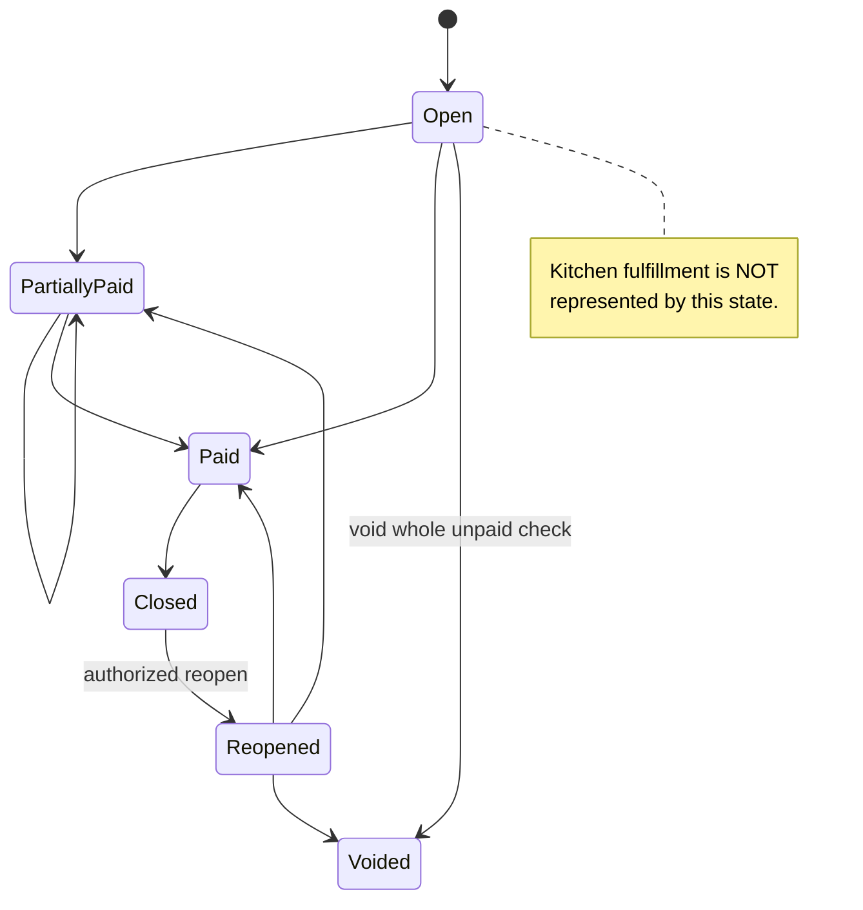
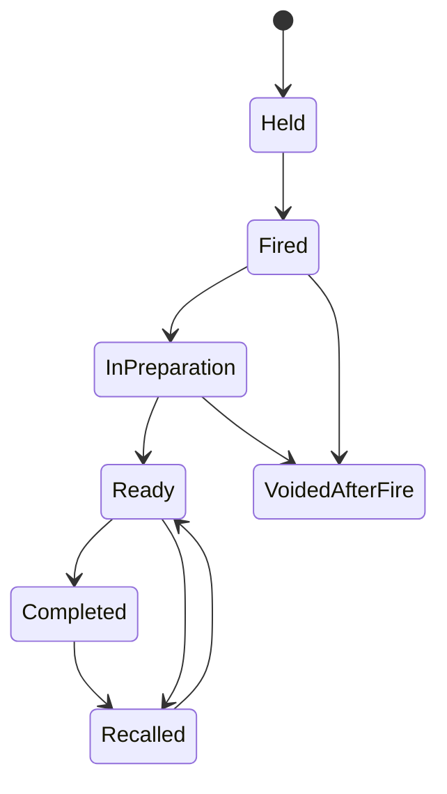
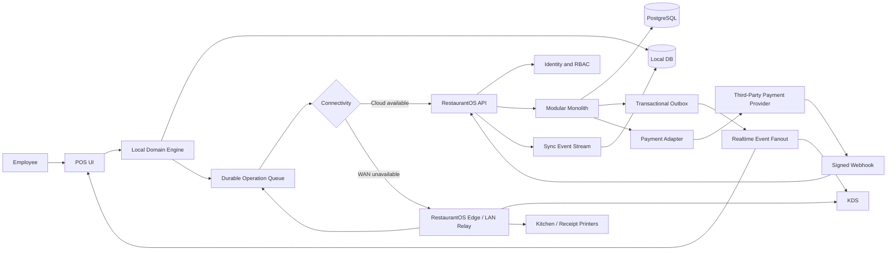

# RestaurantOS Project Requirements, Prototype Gap Analysis, and MVP Architecture Blueprint

## Executive summary

The attached **RestaurantOS project instructions** are not merely a feature brief for a POS screen. They define a much larger product-discovery and systems-design exercise: use Toast as a competitive benchmark, document restaurant workflows and domain rules, separate publicly documented behavior from inference, then turn those findings into a vendor-neutral RestaurantOS architecture, data model, offline strategy, MVP, build sequence, and risk register. The instructions explicitly say the existing `index.html` is a **product-discovery prototype rather than a production architecture**, and they require the final RestaurantOS product to have its own architecture, code, UX, and design language. fileciteturn0file0

There is one important source limitation: **the requirements attachment is available in this session, but the actual `index.html` source is not present in the accessible uploaded files**. I therefore cannot truthfully inventory its DOM, JavaScript functions, CSS rules, event handlers, or individual UI elements. I will not fabricate that analysis. The prototype-compliance matrix below marks source-dependent findings as **Not verifiable** and instead specifies exactly what should be inspected and what a production implementation will require. This is the main unresolved part of the requested analysis.

The strongest architectural conclusion is that RestaurantOS should **not** evolve from one large `index.html` into a collection of cloud-only CRUD endpoints. Restaurant POS is fundamentally a distributed, stateful, occasionally disconnected system. Toast's public documentation demonstrates why: its menu model contains reusable and inherited modifier structures, orders contain checks/selections/payments/discounts, order changes generate integration events, and its POS explicitly maintains locally stored operational/payment data during outages. Toast has also introduced local-network synchronization so KDS devices can continue receiving on-premise orders when the cloud or ISP is unavailable, while a local-network failure has materially different consequences. citeturn0search0turn0search8turn1search2turn1search0turn2search1

For RestaurantOS, the best early-stage shape is a **TypeScript modular monolith backed by PostgreSQL, plus a real local-first POS data layer and a deliberately separate payment adapter**. A modular monolith is substantially easier to reason about, transact against, deploy, debug, and change during product discovery than premature microservices. The POS should write operational actions locally first, attach stable client-generated IDs and idempotency keys, and synchronize them to the cloud. For a browser/PWA implementation, IndexedDB is designed for persistent structured client-side data and service workers provide the primitives for offline asset/network behavior. citeturn5search0turn5search2turn5search3

Payments should be **integrated, not built**. Products such as Stripe Terminal and Adyen already provide certified reader integrations and explicit offline-payment mechanisms. Stripe documents SDK-based Terminal integrations and offline storage/forwarding; Adyen documents offline EMV/store-and-forward, reconciliation, retry, and offline risk controls. Both illustrate why RestaurantOS should own *payment orchestration state* while delegating card acquisition, encryption, EMV/NFC processing, and PCI-sensitive card handling to a payment provider. citeturn3search0turn3search1turn3search3turn3search4

The implementation priority should therefore be:

**P0 domain correctness → local persistence/sync → menu/order/check state → KDS → integrated payments → employee permissions/audit → close/reconciliation → operational hardening.**

The thing most likely to sink a pilot is not whether the UI looks polished. It is a check that was split incorrectly, an order that disappeared during an outage, a duplicate kitchen fire after reconnection, or a payment that RestaurantOS thinks succeeded when the processor does not.

## Requirements distilled from the project instructions

A useful distinction is that the attachment mixes **research requirements**, **product requirements**, and **pilot assumptions**. Those should not all become tickets in the same backlog.

| Requirement family | What the instructions actually demand | Product implication |
|---|---|---|
| Competitive research | Study Toast's restaurant-facing POS, especially full-service workflows, using official documentation first | Build a requirements corpus, not a visual clone |
| Evidence discipline | Classify Toast findings as `DOCUMENTED`, `OBSERVED`, `INFERRED`, or `UNKNOWN` | Architecture decisions need provenance; undocumented Toast internals must never be treated as fact |
| Front-of-house | Login, clock-in, tables, seats, items, modifiers, courses, hold/fire, transfers, splits, discounts, voids, payments, receipts, close/reopen, shift close | Core POS needs a real workflow/state engine rather than generic CRUD |
| Table service | Floor plans, tables, sections, seats, guest counts, timers, transfers, combining tables, multiple checks/parties | Dining-room state must be modeled independently from checks |
| Menu | Hierarchy, variations, modifiers, nested modifiers, min/max/defaults, pricing, taxes, availability, dayparts, 86, routing | Menu configuration is one of the deepest domains in the system |
| Order/check | Orders, checks, line selections, modifiers, fulfillment, discounts, taxes, payments, refunds, tips, seats/courses | Financial state and kitchen fulfillment state must not be collapsed into one status |
| Kitchen | Stations, tickets, routing, timers, expo, hold/fire, void/change after fire, ready status, printers/KDS | Kitchen needs its own projection/workflow |
| Reliability | Internet, Wi-Fi/LAN, cloud, device, KDS, printer and processor failures; synchronization and conflicts | Offline operation is a first-class P0 architecture requirement |
| Payments | EMV/NFC/swipe, cash, gift cards, tips, preauth, partial/split tender, refunds, offline payments | Integrate a processor; keep PCI-sensitive data outside RestaurantOS wherever possible |
| Security | Employees, PINs, roles, approvals, cash permissions, discounts/voids/refunds, audit log | RBAC and immutable audit events are P0 |
| Cash/EOD | Drawers, starting cash, pay-in/out, expected/actual, over/short, reconciliation, close business day | Financial close is a workflow, not merely a report |
| UX | POS hierarchy, order entry, modifier UI, tables, payments, handhelds, KDS, touch ergonomics | Optimize for tap count, immediate feedback, muscle memory, obvious state |
| Architecture | POS client, local store, sync engine, services, events, reporting, audit, device management | Modular boundaries should exist even if initially deployed as one backend |
| Local-first | Source of truth, local/cloud states, operation queue, conflicts, versions, device IDs | Requires explicit synchronization protocol |
| Database | PostgreSQL-oriented relational model | Normalize authoritative business state; use JSON selectively |
| Hardware | Terminal, handheld, KDS, printers, cash drawer, card reader, networking | Hardware abstractions and device capability model are required |
| Integrations | Orders, menus, payments, restaurant, labor, stock, kitchen, webhooks, devices | External API/event surface should evolve from internal domain boundaries |
| MVP | Single-location independent full-service restaurant, KDS, third-party payments, outage tolerance | Scope aggressively around one restaurant operating model |
| Delivery | P0/P1/P2, build phases, risk register, open pilot questions | Architecture decisions need a staged rollout plan |

These requirements come directly from the attached project brief. fileciteturn0file0

A particularly important detail is **modifier complexity**. Toast publicly documents menu → menu group → menu item → modifier-group/modifier concepts, group-level inheritance, reusable modifier entities, and nested modifiers; its API also exposes minimum/maximum modifier selection counts. That makes a flat `menuItems[]` array with a `modifiers: string[]` property inadequate for RestaurantOS. citeturn0search0turn0search2turn0search6turn0search8

Likewise, **order and check should not be synonyms**. Toast's Orders API describes an order as containing one or more guest checks and exposes checks, items, prices, payments, discounts, and customer data. RestaurantOS does not need to copy that schema, but the conceptual separation is valuable: a table/party can generate operational orders while the check acts as the financial grouping eventually paid by one or more tenders. citeturn1search2turn0search5

The attached specification's most important nonfunctional requirement is outage tolerance. Toast publicly distinguishes local-network outages from Internet/cloud outages. With its local-sync model, devices on the same LAN can relay POS updates to KDS during an ISP/cloud outage; when the local network itself is lost, device-to-device and printer communication fail. This is strong evidence that "`navigator.onLine` + retry failed HTTP requests" is nowhere near enough for a restaurant-grade system. citeturn2search0turn2search1turn2search2

## Prototype structure and requirements mapping

Because the actual `index.html` is unavailable, its HTML structure cannot be analyzed at element level. Specifically, I cannot establish whether it contains semantic sections, inline or external CSS, hard-coded menu data, modal components, local state, payment simulations, table components, DOM event handlers, or any network calls.

That missing source affects only the **Current RestaurantOS Prototype** column below. The required target behavior can still be derived from the project specification and official Toast documentation.

| Capability | Current `index.html` | Requirement / benchmark | Importance | MVP? | Gap or verification needed |
|---|---|---|---|---|---|
| Application shell/navigation | **Not verifiable** | POS must support distinct table/order/payment/KDS/admin workflows | Critical | Yes | Inspect screen routing and state preservation |
| Employee PIN login | **Not verifiable** | Instructions explicitly require employee login/PIN and RBAC | Critical | Yes | Need authenticated employee/device session |
| Clock in/out | **Not verifiable** | Explicit FOH and employee requirement | High | Yes | Need shift persistence and permissions |
| Floor plan | **Not verifiable** | Areas, tables, occupancy, sections and timers are explicit | Critical | Yes | Need persistent floor-plan/table model |
| Table state | **Not verifiable** | Available/occupied/check-requested/paid-not-cleared cases | Critical | Yes | Avoid deriving table status purely from CSS/UI state |
| Guest count | **Not verifiable** | Explicit table/check workflow | High | Yes | Persist with party/check |
| Seat assignment | **Not verifiable** | Required for seat-based ordering/splitting | High | Yes | Need stable seat IDs |
| Menu categories | **Not verifiable** | Hierarchical menu structure required | Critical | Yes | Need versioned configuration rather than hard-coded buttons |
| Menu item variations | **Not verifiable** | Explicit requirement | High | Yes | Separate product/item identity from sellable variation |
| Modifier groups | **Not verifiable** | Required/optional/min/max/default/nested behavior | Critical | Yes | Need validated constraint model |
| Nested modifiers | **Not verifiable** | Explicit research requirement; Toast documents nested modifiers | Medium/High | Likely | Data model must permit recursion even if V1 UI limits depth. citeturn0search8 |
| Item quantity | **Not verifiable** | Explicit | Critical | Yes | Money calculations must use integer minor units |
| Notes/special instructions | **Not verifiable** | Explicit | High | Yes | Kitchen-visible notes and audit behavior needed |
| Allergy indicator | **Not verifiable** | Explicit | High | Yes | Must be prominent but not represented as a safety guarantee |
| Seats/courses | **Not verifiable** | Explicit | High | Yes | Separate seat/course fields from display order |
| Hold/fire | **Not verifiable** | Required restaurant workflow | Critical | Yes | Needs persistent kitchen-send state |
| Send to kitchen | **Not verifiable** | Core requirement | Critical | Yes | Must create durable, idempotent dispatch event |
| Add later | **Not verifiable** | Explicit | Critical | Yes | Existing check remains mutable under controlled rules |
| Move/transfer item | **Not verifiable** | Explicit | High | Yes | Requires audit event and concurrency rules |
| Transfer table/check/server | **Not verifiable** | Explicit | High | Yes | Manager rules configurable |
| Split check | **Not verifiable** | By item/seat/shared item requested | Critical | Yes | High-complexity financial operation |
| Merge checks | **Not verifiable** | Explicit | Medium/High | P1 candidate | Preserve provenance and payment restrictions |
| Discount | **Not verifiable** | Explicit | High | Yes | Need policy/eligibility + approval model |
| Comp | **Not verifiable** | Explicit | High | Yes | Must record actor/reason/approval |
| Void | **Not verifiable** | Explicit | Critical | Yes | Sent vs unsent voids need different effects |
| Refund | **Not verifiable** | Explicit | Critical | Yes after payment | Processor-driven async lifecycle |
| Taxes | **Not verifiable** | Explicit menu/order concern | Critical | Yes | Must be configuration-driven and testable |
| Service charge/gratuity | **Not verifiable** | Explicit | Critical | Restaurant-dependent P0 | Do not model as generic discount/tip |
| Cash | **Not verifiable** | Explicit | Critical | Yes | Cash payment plus drawer reconciliation |
| Card payment | **Not verifiable** | Explicit | Critical | Yes | Integrate external terminal/provider |
| Tips | **Not verifiable** | Explicit | Critical | Yes | Pre/post-auth behavior depends on provider |
| Partial/split tender | **Not verifiable** | Explicit | Critical | Yes | Payment aggregate must allow many attempts/tenders |
| Card preauthorization/bar tabs | **Not verifiable** | Explicit | High | Depends on pilot | Provider capability required |
| Receipt | **Not verifiable** | Explicit | High | Yes | Printer/email/text strategy |
| Close/reopen check | **Not verifiable** | Explicit | Critical | Yes | Reopen permission + audit trail |
| KDS | **Not verifiable** | Stations/routing/status/timers/recall required | Critical | Yes | Separate KDS client/projection required |
| Kitchen printer fallback | **Not verifiable** | Reliability requirement | High | P1/P0 depending restaurant | Hardware abstraction required |
| Offline ordering | **Not verifiable** | Explicit pilot condition: outage must not stop service | Critical | Yes | Local transactional store + operation journal |
| Offline LAN KDS | **Not verifiable** | Desirable architecture inferred from operational requirement | Critical | Yes | Browser/cloud-only design cannot guarantee this by itself |
| Synchronization | **Not verifiable** | Explicit queue/conflicts/idempotency/versioning | Critical | Yes | Dedicated sync protocol |
| Audit trail | **Not verifiable** | Explicit | Critical | Yes | Append-only audit events |
| Reporting/EOD | **Not verifiable** | Explicit | High | Yes | Build from transactional ledger/events |
| Device management | **Not verifiable** | Explicit architecture/hardware concern | High | P1 | Device registration/health/configuration |
| Integrations/webhooks | **Not verifiable** | Explicit | Medium | Later public API; payment required now | Build internal event surface first |

One architecture lesson from Toast's public API is especially applicable here. Its menu API uses IDs/references instead of expanding every reusable modifier group repeatedly, and Toast explicitly documents reuse/inheritance of menu entities. RestaurantOS should likewise **normalize configuration entities and use join/assignment records**, rather than duplicate complete modifier objects inside every menu item. citeturn0search1turn0search6

Another useful pattern is event notification. Toast's order webhook emits a unique event ID, timestamp, restaurant identity, and the updated order when an order changes. RestaurantOS should not copy that payload, but stable event IDs and replay-safe event consumption are exactly the sort of integration property a mature POS needs. citeturn1search0

## Missing production surface: assets, scripts, backend, data, and integrations

Until `index.html` itself is available, the items below should be read as **production requirements that must exist somewhere**, not as claims that every one is absent from the prototype.

| Surface | Production requirement | Why it matters |
|---|---|---|
| Front-end application structure | Componentized POS, KDS and admin applications rather than one HTML file | Isolates workflow/state and enables testing |
| Design tokens | Typography, spacing, touch-target, status, focus, error and accessibility tokens | Prevents inline-style drift |
| Icon system | Local or packaged icon set | POS must not depend on fragile external CDNs |
| Font strategy | Locally served/system fonts preferred for POS | Application must render during Internet outages |
| App manifest | PWA manifest where browser deployment is used | Installable device experience |
| Service worker | Static-shell caching/version management | Browser application must boot offline; service workers support offline-first asset handling. citeturn5search2 |
| Local database | IndexedDB wrapper for web; SQLite for native/edge | Durable checks/orders cannot live only in JS memory; IndexedDB supports persistent structured data and transactions. citeturn5search0turn5search3 |
| Operation journal | Locally durable queue containing operation ID, aggregate ID, device ID, expected version and payload | Core of offline synchronization |
| Sync worker | Push unsynced commands, pull remote events, retry and reconcile | Makes intermittent connectivity survivable |
| Connectivity monitor | Distinguish API/cloud reachability from LAN/provider reachability | Different outage classes require different behavior |
| Real-time transport | WebSocket or SSE for cloud-connected KDS/config updates | Avoid high-frequency polling |
| LAN transport | Edge relay/local hub protocol | Required if KDS should work when Internet is down |
| Money library/rules | Integer minor-unit values plus explicit rounding/tax rules | Floating-point currency errors are unacceptable |
| Menu validation | Modifier min/max/defaults, availability and publishing validation | Invalid configuration can make ordering impossible |
| State machines | Check, item, kitchen ticket, payment, shift, drawer states | Prevents impossible transitions |
| Auth client | Device registration, employee PIN session, manager approval | RBAC and audit identity |
| Payment adapter | Provider SDK + backend orchestration + webhook receiver | Keeps raw card handling outside RestaurantOS |
| Printer adapter | Receipt/kitchen printer discovery, jobs, retries, health | Printing is an unreliable I/O subsystem |
| KDS application | Station queues, timers, bump/recall, expo | Core pilot requirement |
| Audit client/service | Append-only high-value action trail | Voids, comps, refunds, reopen and cash changes need accountability |
| Telemetry | Structured logs, traces, sync metrics, device health | Remote support is essential once a restaurant is live |
| Crash/error handling | Global client error reporting and persisted recovery state | A crashed POS must reopen without losing the active check |
| Configuration/versioning | Published immutable menu/floor/config snapshots | Devices need consistent versions offline |
| Migration layer | Schema and configuration migrations | Local and cloud databases will evolve independently |
| Test fixtures | Realistic restaurant menus, modifiers, tables and payment scenarios | Simple demo data will miss POS edge cases |

The **backend** should initially be one deployable modular application with internal packages/modules roughly corresponding to identity, restaurant configuration, menu, dining room, checks/orders, kitchen, payment orchestration, labor, cash, sync and audit. This is a RestaurantOS recommendation, **not a claim about Toast internals**.

A modular monolith is preferable here because order mutations commonly touch several strongly related invariants at once. For example, moving an item between checks may affect discounts, taxes, kitchen provenance and check totals. Keeping those invariants in one transactional PostgreSQL boundary is much easier during an early pilot than coordinating several independently deployed services.

For cloud persistence, **PostgreSQL is the default recommendation**. It provides relational transactions for the highly connected POS domain and also has `jsonb` for bounded extension data where a rigid column model is counterproductive. The current PostgreSQL documentation continues to support JSON/JSONB alongside relational structures. citeturn4search2turn4search7

| Storage option | Recommended role | Fit |
|---|---|---|
| PostgreSQL | Cloud authoritative transactional database | **Best default** |
| IndexedDB | Browser POS local store | **Best web-client default**; transactional structured client storage. citeturn5search0 |
| SQLite | Native POS or on-premises edge/hub store | Strong alternative if moving beyond a browser/PWA |
| Redis | Cache, ephemeral locks, real-time fan-out | Optional; **not** source of truth |
| Document database | Narrow document/event workloads | No compelling reason to make it the main V1 database |
| Event broker | Async integration/reporting at scale | Defer until real load/integration needs justify it |

**Payments are the major third-party integration that should be mandatory for the pilot.** Stripe Terminal supports custom POS integrations with pre-certified readers and SDKs, while Adyen provides a comparable terminal-oriented surface. Both have explicit offline-payment support, though integration modes and capabilities differ. Stripe, for example, documents that its server-driven Terminal integration does not support offline collection, while its SDK-based approach supports offline workflows; this has direct architecture implications when selecting a provider. citeturn3search0turn3search2turn3search4

RestaurantOS should therefore never store PAN/card-track data itself. It should persist provider-neutral data such as `payment_id`, `provider`, `provider_reference`, requested amount, authorized amount, captured amount, tip, status, terminal/device identity, failure code and timestamps. Certified readers/payment SDKs should handle the sensitive payment details. Stripe specifically describes its pre-certified readers as encrypting payment details and returning tokenized/payment information to the application flow. citeturn3search3

Offline payments need separate product policy because authorization may occur only after connectivity returns. Toast publicly warns that offline payments can later be declined; Stripe and Adyen likewise document store-and-forward/offline behavior and associated risk. RestaurantOS needs a visible distinction between **locally accepted/pending upload** and **processor authorized** rather than showing both as simply "Paid." citeturn2search11turn3search1turn3search4

## Prioritized implementation plan and recommended stack

Effort below is relative engineering difficulty, not a calendar promise: **Low** means bounded implementation with few domain interactions, **Medium** means meaningful cross-module behavior, and **High** means state/concurrency/hardware/payment/reliability work requiring extensive integration testing.

| Priority | Work item | Effort | Suggested implementation | Rationale |
|---|---|---:|---|---|
| P0 | Convert prototype into real app structure | Medium | TypeScript + React; Vite or comparable build tooling | Establish testable components and domain boundaries |
| P0 | Shared domain package | High | TypeScript types + explicit command/state-machine functions | Pricing and state rules must not live in button handlers |
| P0 | Monetary primitives | Medium | Integer minor units + ISO currency + deterministic rounding | Foundation for every check/payment invariant |
| P0 | PostgreSQL schema + migrations | High | PostgreSQL + Drizzle/Prisma/Kysely, or SQL-first migrations | Strong relational fit; Postgres remains the recommended cloud store. citeturn4search2 |
| P0 | Restaurant/location/device bootstrap | Medium | REST bootstrap endpoint + local config cache | Device must boot into correct tenant/location/configuration |
| P0 | Employee PIN/RBAC | Medium | Argon2id/bcrypt PIN verifier; short-lived signed session | Every mutation needs actor identity |
| P0 | Menu/config domain | High | Versioned Menu/MenuGroup/Item/Variation/ModifierGroup graph | Modifier inheritance/reuse makes this more than a static array. citeturn0search0turn0search6 |
| P0 | Floor-plan/table model | Medium | React touch UI + persistent DiningArea/Table/Party state | Required full-service workflow |
| P0 | Check/order-item engine | High | Command handlers + optimistic aggregate versions | Central operational aggregate |
| P0 | Modifier validation | High | Shared deterministic validation library | Enforce min/max/default/nesting on every client/server path |
| P0 | Send/hold/fire semantics | High | Immutable order-dispatch records + kitchen events | Prevent repeated/ambiguous kitchen sends |
| P0 | KDS | High | Separate React app + WebSocket + local/LAN delivery | Pilot requires kitchen operation |
| P0 | Local DB | High | IndexedDB through Dexie-like wrapper, or SQLite in native shell | Persistent offline state; IndexedDB supports offline structured storage. citeturn5search0turn5search3 |
| P0 | Sync engine | **High** | Client operation log + idempotent `/sync` API + versions | One of the largest system risks |
| P0 | Split checks | **High** | Dedicated domain operation, not UI-only reassignment | Money/discount/tax/payment invariants intersect |
| P0 | Discounts/comps/voids | High | Domain commands + reason + RBAC + audit | Financial accountability |
| P0 | Payment adapter | **High** | Stripe Terminal or Adyen adapter behind own interface | Integrate rather than implement card processing. citeturn3search0turn3search4 |
| P0 | Cash tender | Medium | Payment tender + cash drawer event model | Full-service pilot cannot assume card-only |
| P0 | Audit log | Medium | Append-only audit table + before/after metadata | Required for privileged financial operations |
| P0 | Offline UX | High | Explicit cloud/LAN/payment status indicators | Staff need to know exactly what remains safe to do |
| P0 | Crash recovery | High | Local transaction + periodic durable state | Restart must not erase open restaurant work |
| P0 | E2E/chaos test harness | High | Playwright + API/integration tests + network fault scenarios | Offline bugs cannot be left to manual QA |
| P1 | Printer abstraction | High | ESC/POS/network-print bridge or platform-specific daemon | Kitchen/receipt hardware is operationally messy |
| P1 | Cash drawer reconciliation | Medium | Drawer session and cash event ledger | Needed for dependable close |
| P1 | Business-day close | High | Blocking-issues workflow + reconciliation summary | Turns raw transactions into operational close |
| P1 | Device management | Medium | Device registry/config/heartbeat | Essential once multiple terminals exist |
| P1 | Reporting projections | Medium | SQL projections/materialized summaries | Keep reporting off hot transaction code |
| P1 | Menu publishing UI | High | Draft/published configuration snapshots | Production restaurants need safe menu change management |
| P1 | Bar tabs/preauth | High | Provider-specific payment capability | Only elevate to P0 if pilot restaurant needs it |
| P1 | Gift cards | High | Third-party integration first | Network and accounting complexity |
| P2 | Reservations/waitlist | High | Integrate initially | Not core transaction path |
| P2 | Loyalty | High | Integrate initially | Separate product/domain |
| P2 | Online ordering/delivery | High | Integration/API surface | Adds asynchronous external-order semantics |
| P2 | Scheduling | High | Integrate initially | Not required to prove RestaurantOS POS |
| Do not build yet | Proprietary payment processing | Extreme | **Use PSP/acquirer integration** | PCI, networks, certifications and risk are not startup MVP work |
| Do not build yet | Microservice fleet | High recurring cost | Keep modular monolith boundaries | Deployment topology does not create useful product differentiation |
| Do not build yet | Custom POS hardware | Extreme | Commodity tablets + certified peripherals | Prove software/product before hardware supply chain |

For a browser-oriented V1, the practical stack I would choose is:

**Client:** React + TypeScript + PWA shell + IndexedDB, with a domain layer that contains no React code. Service workers can cache the application shell for offline startup, while IndexedDB stores operational data and the pending-operation queue. citeturn5search0turn5search2

**Backend:** TypeScript modular monolith using Fastify/NestJS-style module boundaries, PostgreSQL, an OpenAPI-described REST interface, WebSocket/SSE for real-time projections, and a transactional outbox for externally visible events.

**Payments:** Start with a provider interface and implement exactly one production provider. Stripe Terminal exposes SDKs for JavaScript, Android, iOS and React Native plus certified readers; Adyen is a serious alternative where its terminal/fleet capabilities or offline behavior better match the pilot. citeturn3search0turn3search4

**Do not treat a pure cloud PWA as the entire offline architecture.** A service worker can make the application runnable offline, but keeping POS terminals and KDS synchronized while the WAN is down requires an additional same-LAN communication mechanism or edge coordinator. Toast's documented local-sync behavior is evidence of the operational need, not evidence that RestaurantOS should copy Toast's implementation. citeturn2search0turn2search1

A reasonable V1 edge strategy is a lightweight **RestaurantOS Edge** process on a small Linux appliance, designated countertop terminal, or local server. It can provide LAN discovery, WebSocket fan-out, local order-event relay, printer adapters and optional SQLite buffering. The cloud remains the long-lived system of record; the edge process exists to keep the restaurant operating through WAN loss. This is a **RestaurantOS recommendation**, not a documented Toast architecture.

## MVP backend API and domain design

The API should be **command-oriented where business rules matter** rather than exposing arbitrary `PATCH` operations on every database row. "`PATCH /checks/123` with whatever object the browser currently has" is a concurrency and audit nightmare.

A useful rule is:

> The client asks the domain to perform an operation; it does not directly describe the final database state.

So prefer `POST /checks/{id}/split`, `POST /items/{id}/void`, and `POST /checks/{id}/send` over a generic endpoint that lets the UI replace the complete check.

**Authentication model**

For internal POS users, use a registered-device session plus employee authentication. A device receives a device credential during provisioning; an employee PIN exchange returns a short-lived POS session containing `organizationId`, `locationId`, `deviceId`, `employeeId` and effective permissions. Sensitive commands can require a manager-approval token generated by a second employee.

For future third-party API access, OAuth 2.0 client credentials is a sensible machine-to-machine alternative. Toast itself uses OAuth 2 client-credentials for its external API integrations, which demonstrates the suitability of that pattern for partner/service access, but RestaurantOS employee logins should **not** use machine-client credentials. citeturn1search1

| Endpoint | Purpose | Key semantics |
|---|---|---|
| `POST /v1/devices/register` | Provision POS/KDS device | Admin-controlled one-time enrollment |
| `POST /v1/sessions/pin` | Employee login | PIN + registered device → short-lived session |
| `POST /v1/manager-approvals` | Approve privileged command | Single-use, short-lived approval token |
| `GET /v1/bootstrap` | Load location/config versions | Menus, floor plan, roles, settings, device config |
| `GET /v1/menus/{version}` | Retrieve immutable menu snapshot | Supports offline caching |
| `GET /v1/floor-plans/{version}` | Retrieve floor snapshot | Supports offline caching |
| `POST /v1/checks` | Open table/tab check | Client-generated UUID accepted |
| `GET /v1/checks/{id}` | Read server projection | Includes aggregate version |
| `POST /v1/checks/{id}/items` | Add configured item | Validates menu snapshot/modifiers |
| `POST /v1/checks/{id}/send` | Dispatch unsent items | Creates immutable dispatch/order batch |
| `POST /v1/checks/{id}/split` | Split by items/seats/amount rules | Transactional domain command |
| `POST /v1/checks/{id}/transfer` | Transfer table/server | RBAC + audit |
| `POST /v1/order-items/{id}/void` | Void item | Reason/approval and kitchen consequences |
| `POST /v1/checks/{id}/discounts` | Apply discount/comp | Eligibility + approval |
| `POST /v1/payment-intents` | Begin payment | Provider-neutral payment orchestration |
| `GET /v1/payments/{id}` | Current normalized status | Never infer success solely from UI |
| `POST /v1/payments/{id}/tip-adjustment` | Adjust tip where allowed | Provider/status validation |
| `POST /v1/payments/{id}/refunds` | Request refund | Async provider lifecycle |
| `POST /v1/kitchen-tickets/{id}/bump` | Mark station work complete | Idempotent |
| `POST /v1/kitchen-tickets/{id}/recall` | Recall ticket | Audited |
| `POST /v1/shifts` | Clock in | Employee/location |
| `POST /v1/shifts/{id}/clock-out` | Clock out | Close checks/review rules |
| `POST /v1/drawers/{id}/events` | Pay-in/pay-out/count | Immutable cash event |
| `POST /v1/business-days/{date}/close` | Attempt EOD close | Returns blockers or close result |
| `POST /v1/sync/operations` | Upload local operation batch | Idempotent per operation ID |
| `GET /v1/sync/events?cursor=…` | Download missed remote events | Ordered cursor/replay |
| `POST /v1/webhooks/payments/{provider}` | Payment provider callback | Signature verification + deduplication |
| `GET /health/live` | Process liveness | Infrastructure |
| `GET /health/ready` | Dependency readiness | Database/etc. |

Every mutation made by a device should carry something conceptually like:

```json
{
  "operationId": "01K2...ULID",
  "deviceId": "01K1...ULID",
  "clientTimestamp": "2026-08-11T01:02:03.456Z",
  "aggregateVersion": 17,
  "command": {
    "type": "ADD_ORDER_ITEM",
    "checkId": "01K2...",
    "menuSnapshotId": "01K0...",
    "menuItemVariationId": "01JZ...",
    "quantity": 1,
    "seatNumber": 2,
    "modifiers": [
      {
        "modifierGroupId": "01JX...",
        "modifierId": "01JY...",
        "quantity": 1
      }
    ]
  }
}
```

A successful result should return the canonical server version and relevant events:

```json
{
  "operationId": "01K2...ULID",
  "status": "APPLIED",
  "aggregate": {
    "id": "01K2...",
    "version": 18
  },
  "events": [
    {
      "eventId": "01K3...",
      "type": "ORDER_ITEM_ADDED",
      "sequence": 18432
    }
  ]
}
```

Repeating the same `operationId` must return the already-known result rather than execute the command again. This property is crucial when a terminal cannot know whether a request reached the server before the network died.

For genuine concurrent conflict:

```json
{
  "operationId": "01K2...",
  "status": "CONFLICT",
  "reason": "STALE_AGGREGATE_VERSION",
  "expectedVersion": 17,
  "currentVersion": 19,
  "retryable": false
}
```

The client can then fetch/replay intervening events and either deterministically rebase the command or require employee resolution.

The relational model I recommend is below. This is **vendor-neutral RestaurantOS design** rather than an attempted reconstruction of Toast's private schema.



Several modeling decisions here deserve emphasis.

**`MENU_SNAPSHOT` is immutable once published.** An order item should retain the name, price, tax/routing-relevant configuration and modifier selections that applied when it was ordered; changing tomorrow's menu must not rewrite yesterday's check.

**`MENU_GROUP_ITEM` is a join rather than `menu_item.menu_group_id`.** Toast documentation shows why this flexibility matters: menu items can participate in multiple menu paths, and the path itself can affect modifier groups and pricing. RestaurantOS need not reproduce Toast's implementation, but a many-to-many association is the safer generic design. citeturn0search0turn0search5

**`ORDER_DISPATCH` separates financial editing from kitchen sends.** A server might open a check at 7:00, send appetizers at 7:05, add entrées at 7:20 and desserts at 8:00. A single mutable `order.sent=true` flag loses that history. Dispatch batches provide an immutable answer to "what did we tell the kitchen, and when?"

**Payments need attempts.** A `PAYMENT` is the business tender allocation, whereas `PAYMENT_ATTEMPT` represents provider interactions such as initiated, reader waiting, offline pending, authorized, failed and captured. That makes retries observable instead of overwriting one row.

**Voids, comps, discounts, transfers and reopen actions should produce audit events.** Audit information should contain who, where, device, command/action, target IDs, reason, approval actor if applicable, UTC timestamp and meaningful before/after or event metadata.

A minimum set of state models should resemble the following conceptual separation:



Kitchen fulfillment is separately modeled:



The exact kitchen states should be validated with the pilot restaurant because a prep station and an expo station often need different semantics.

The request and synchronization flow should be:



The key ordering rule is **UI → local domain transaction → local durable store → synchronization**, not **UI → HTTP → maybe save something locally if HTTP fails**. The former is local-first. The latter is merely a cloud app with retries.

For the attached requirements' example—Terminal A sends Pad Thai while offline, Terminal B changes another item, KDS remains on LAN—the desired behavior is that both terminals produce unique local operations, the LAN edge relays kitchen-relevant operations to KDS, and each operation is later pushed to the cloud exactly once logically. Operations against different items can ordinarily merge. Two incompatible operations against the same stateful entity require aggregate/version conflict rules. A later cloud acknowledgment must never cause the already-displayed Pad Thai to fire to the KDS a second time.

Toast's public outage behavior reinforces the requirement. Its local-sync documentation says KDS can continue receiving orders from POS devices on the same LAN during ISP/cloud outages, while offline workflows impose restrictions and devices retain locally stored information. That is a product requirement lesson; RestaurantOS should design its own protocol. citeturn2search0turn2search1turn2search2

## Testing, deployment, and CI/CD strategy

RestaurantOS needs substantially more than unit tests around React components. The riskiest defects live at domain and distributed-system boundaries.

| Test layer | What to test | Priority |
|---|---|---|
| Domain unit tests | Modifier min/max/default rules, totals, taxes, discounts, seats, courses, permissions, state transitions | P0 |
| Invariant/property tests | Split/merge conservation of money, quantity, tax and adjustments | P0 |
| Database integration | Transactions, optimistic versions, unique idempotency keys, outbox atomicity | P0 |
| API contract tests | Request schemas, error types, auth and version conflicts | P0 |
| Payment contract tests | Reader timeout, decline, duplicate webhook, late authorization, refund failure | P0 |
| Sync tests | Duplicate operations, reorder, replay, stale version, partial upload | **P0** |
| Network partition tests | WAN loss with LAN alive, LAN loss, API timeout after commit, reconnection | **P0** |
| Restart tests | Browser/terminal restart with open checks, queued operations and payments | **P0** |
| KDS tests | Duplicate event, station routing, bump, recall, update after fire | P0 |
| End-to-end UI | Employee → table → order → modifiers → fire → pay → close | P0 |
| Multi-terminal E2E | Concurrent table/check changes on two terminals | P0 |
| Hardware-in-loop | Card terminal, printer, cash drawer, KDS networking | P0 before pilot |
| Security | PIN brute force, tenant isolation, privilege escalation, webhook verification | P0 |
| Performance | Dinner-rush burst simulation, KDS latency, menu bootstrap | P1 before pilot |
| Recovery/backup | Restore PostgreSQL and reconstruct projections | P1 before pilot |

Playwright is a strong choice for POS browser end-to-end tests because its official tooling supports Chromium, Firefox and WebKit and includes tracing, assertions and parallel execution. For a real POS deployment, concentrate the hardware qualification matrix on the actual browser/device configuration used by the restaurant instead of pretending broad desktop-browser compatibility is equally important. citeturn3search6

**Property-based testing deserves unusual emphasis.** For example, generate arbitrary checks containing many items, taxes, discounts and seats; randomly partition their items into N checks; assert that total item quantity and financial value are conserved except where explicit policy changes them. Do the same for partial payments. This will discover split-check bugs that hand-written "2 burgers + 2 cards" tests never touch.

The offline suite should be automated against a network fault proxy or test harness and cover at least:

1. Request never leaves device.
2. Server commits but response is lost.
3. Server rejects stale version.
4. Device crashes after local write but before enqueue acknowledgment.
5. WAN unavailable while LAN remains usable.
6. LAN unavailable while cloud happens to remain reachable from another device.
7. Two terminals independently modify one check.
8. KDS receives local event before cloud does.
9. Cloud synchronization retries the event.
10. Processor accepts a payment only after RestaurantOS reconnects.

Toast's offline-payment documentation is a good demonstration of why payment recovery needs explicit testing: offline card details/payments may remain queued locally and the eventual authorization can fail. citeturn2search9turn2search11

For deployment, keep the cloud backend deliberately boring.

| Option | Strengths for RestaurantOS | Tradeoff | Recommendation |
|---|---|---|---|
| Google Cloud Run + managed PostgreSQL | Managed container deployment; immutable revisions and controlled traffic migration are supported | Still need separate LAN/edge strategy | **Excellent pilot choice**. Cloud Run supports container revisions and gradual traffic rollout. citeturn6search0turn6search6 |
| AWS ECS/Fargate + RDS PostgreSQL | More infrastructure/networking control with managed serverless container execution | More AWS surface to configure/operate | **Excellent if team is AWS-native**. Fargate removes EC2 cluster management. citeturn6search1 |
| Simpler managed PaaS + PostgreSQL | Very low initial ops | Evaluate network controls, backups and operational tooling before production | Good prototype/pilot alternative |
| Kubernetes | Maximum deployment flexibility | Considerable operational overhead relative to a one-location pilot | **Do not start here** |
| Single VM | Simple mental model | Patching, failover and deployment discipline become your problem | Acceptable only for temporary development |

Cloud hosting does **not** solve restaurant availability. The on-premises edge/LAN path is a separate deployment concern.

For CI/CD, GitHub Actions is a straightforward fit if the repository is on GitHub. GitHub officially supports both CI workflows and deployment workflows, including protected deployment environments; its documentation also supports using OIDC with cloud providers instead of long-lived cloud credentials. citeturn4search0turn4search1

A sensible pull-request pipeline is:

```text
checkout
→ lockfile install
→ formatting check
→ lint
→ TypeScript typecheck
→ unit/domain tests
→ schema/API compatibility checks
→ PostgreSQL integration tests
→ build POS + KDS + backend
→ Playwright smoke tests
→ dependency/security scan
→ build container
```

On merge to `main`:

```text
CI passes
→ build immutable container once
→ push image with commit SHA
→ run migration compatibility check
→ deploy staging
→ seed realistic restaurant fixture
→ integration + E2E + sync tests
→ manual production approval
→ run backward-compatible migrations
→ deploy canary/new revision
→ health + synthetic order test
→ progressively route traffic
→ observe error/sync/payment metrics
→ automatic/manual rollback if gates fail
```

Do not combine destructive schema migration with a deployment that requires the new schema instantaneously. Use **expand/contract migrations**: deploy additive schema first, deploy compatible application code, backfill if necessary, and remove old structures only in a later release. Local database migrations make this even more important because a POS device might stay offline while several cloud releases occur.

Production telemetry should include at least API error rate, command latency, Postgres saturation, active device heartbeats, local operation queue depth, age of oldest unsynced operation, duplicate-operation count, version conflicts, KDS dispatch latency, payment states by age, webhook lag, printer failures and crash/restart recovery incidents. Those are the metrics that answer "Can the restaurant serve dinner?" rather than merely "Is HTTP returning 200?"

## Critical engineering findings and open decisions

The most consequential risks are visible even without `index.html`.

| Risk | Severity | Why it is easy to underestimate | Required mitigation |
|---|---|---|---|
| Offline synchronization | **Critical** | Basic demos work perfectly online | Operation journal, IDs, versions, replay/partition tests |
| Payment state | **Critical** | "Charge card" looks like one action in UI | Provider-neutral state machine + signed webhooks + reconciliation |
| Split checks/tenders | **Critical** | Easy happy path, enormous state space | Domain command + invariant/property tests |
| Money/tax rounding | **Critical** | One-cent differences become reconciliation failures | Central money/tax engine and fixtures |
| Kitchen duplication | **Critical** | Network retries can become duplicate food | Idempotent dispatch/ticket IDs |
| Menu/modifier semantics | High | Restaurant menus behave like configurable programs | Versioned graph + validation |
| Menu publication | High | Editing live data can mutate active service | Immutable snapshots |
| LAN versus WAN outage | High | Often treated as one "offline" boolean | Separate health dimensions and edge design |
| Printer failures | High | Printers are physical/network I/O | Spool/retry/health/fallback |
| RBAC/manager approval | High | Prototype PIN checks are easy to bypass | Server-enforced permissions |
| Auditability | High | Retroactively adding provenance is painful | Append-only events from day one |
| Cash reconciliation | High | Cash does not have processor webhooks | Event ledger + drawer sessions/counts |
| Device restart | High | Browser memory feels persistent during demos | Durable local transaction before success UI |
| Provider webhook duplication | High | External events are normally at-least-once in practice | Deduplication keys/idempotent handlers |
| Operational support | High | Pilot restaurant cannot debug your stack | Health screen + telemetry + remote diagnosis |
| Multi-location | Medium for V1 | Premature generalization costs time | Keep `organization_id/location_id` everywhere, build one-location UX |
| Reservations/loyalty | Medium | Large product surfaces | Integrate later |
| Microservices | Medium architectural risk | Architecture diagram looks sophisticated | Keep module interfaces but one deployable |

The following decisions should be answered with the pilot restaurant **before UI implementation gets much deeper**:

| Pilot question | Architecture affected |
|---|---|
| Full service only, or bar/counter service too? | Check lifecycle, tabs, preauth |
| How many simultaneous POS terminals? | Sync/concurrency/load requirements |
| KDS only, printers only, or both? | LAN edge and hardware adapter |
| Must orders reach KDS with Internet down? | Makes edge/LAN relay P0 |
| How many kitchen stations? | Routing/config model |
| Are courses/hold-fire used routinely? | Order dispatch state model |
| Is seat-level ordering required? | Seat identity and split model |
| What split-check behavior is considered mandatory? | Domain scope |
| Is automatic gratuity used? | Charge/tax/tip rules |
| Are tips adjusted after card authorization? | Payment-provider selection |
| Are bar tabs/preauthorizations required? | Payment-provider selection |
| What is the maximum acceptable offline-card amount/risk? | Payment policy/configuration |
| Are gift cards required on launch day? | Integration scope |
| What printers/cash drawers already exist? | Hardware support matrix |
| What constitutes "close day" operationally? | EOD blockers and reconciliation |
| Which actions require manager approval? | RBAC policy |
| How are voids after kitchen fire handled today? | Kitchen/accounting state |
| How are allergies communicated to kitchen? | UX/ticket requirements |
| Does the restaurant need menu changes during service? | Publishing/versioning |
| What existing POS data must migrate? | Migration tooling |
| What happens operationally when RestaurantOS support is unavailable? | Recovery/runbook requirements |

The key product decision is whether **LAN-continuous service during WAN failure** is really P0. The attached instructions strongly imply yes: they say Internet outages must not stop basic restaurant service. fileciteturn0file0 Toast's public documentation is a useful benchmark here: it distinguishes cloud/ISP outages from local-network failure and provides local-sync behavior for KDS and POS devices. citeturn2search0turn2search1

That requirement should be frozen now because it changes the architecture dramatically. If it is P0, the system needs either a local edge coordinator or peer/local-device protocol. Adding that after building a cloud-only POS is close to an architectural rewrite.

## Conclusion and source basis

The RestaurantOS concept should be treated as **product discovery that is ready to graduate into an explicit domain architecture**, not as an `index.html` that merely needs an API attached to it.

The first production milestone should establish five foundations simultaneously:

**a versioned restaurant/menu model, a deterministic check/order domain, durable local operations, reliable kitchen dispatch, and payment-provider abstraction.**

Everything else should layer on those foundations.

The recommended V1 architecture is therefore:

```text
React/TypeScript POS + KDS
        │
        ├── shared deterministic domain logic
        ├── durable local database
        ├── operation journal / sync engine
        └── optional LAN edge relay
                    │
                    ▼
       TypeScript modular monolith
                    │
        ┌───────────┼────────────┐
        ▼           ▼            ▼
   PostgreSQL   Realtime      Payment Adapter
   + Outbox     projection         │
                                    ▼
                           Stripe/Adyen/etc.
```

The choice to integrate payments is supported directly by the capabilities payment platforms expose: Stripe Terminal and Adyen provide terminal/card-present infrastructure and offline-payment facilities that would otherwise drag RestaurantOS into PCI-sensitive hardware/payment-processing engineering. citeturn3search0turn3search3turn3search4

The choice to build explicit local persistence and sync is likewise grounded in actual restaurant-system behavior rather than theoretical architecture. Toast documents local storage/offline operations, local-sync KDS behavior, queued offline payments, and restrictions that vary depending on whether the LAN or Internet/cloud has failed. RestaurantOS should not reproduce Toast's internal implementation, but it would be a serious mistake to ignore the class of problems those documented behaviors expose. citeturn2search0turn2search1turn2search2turn2search11

The choice to use a richer menu graph is justified by Toast's publicly documented domain semantics—reusable menu items/modifier groups, modifier inheritance, nested modifiers and explicit min/max selection constraints. RestaurantOS should create its own simpler schema, but it needs enough expressive power to represent real restaurant menus without special-casing every new pilot request. citeturn0search0turn0search2turn0search6turn0search8

The final unresolved deliverable is the requested **element-by-element audit of `index.html`**. The requirements file is available and has been analyzed here, but the source HTML itself is not present in the accessible attachment set, so claims about its DOM/components/scripts/styles would be invented. Once that source is actually available to the analysis environment, the compliance table above can be converted from **Not verifiable** into a concrete mapping of DOM/component → requirement → behavior → missing dependency → recommended refactor.

Primary sources used for this analysis are overwhelmingly official documentation: the attached RestaurantOS specification fileciteturn0file0; Toast Platform/Developer documentation for menus, orders, authentication, webhooks and offline/local-sync behavior citeturn0search0turn1search2turn1search1turn1search0turn2search1; Stripe and Adyen's official Terminal/payment documentation citeturn3search0turn3search4; MDN's IndexedDB and service-worker documentation for browser-local persistence/offline execution citeturn5search0turn5search2; PostgreSQL's official documentation citeturn4search2; Playwright's testing documentation citeturn3search6; GitHub's CI/CD documentation citeturn4search0turn4search1; and official Google Cloud/AWS container deployment documentation for the hosting alternatives discussed above. citeturn6search0turn6search1